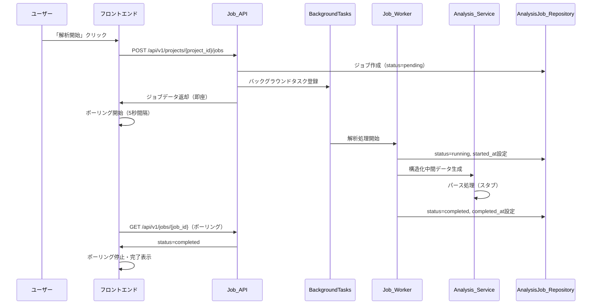
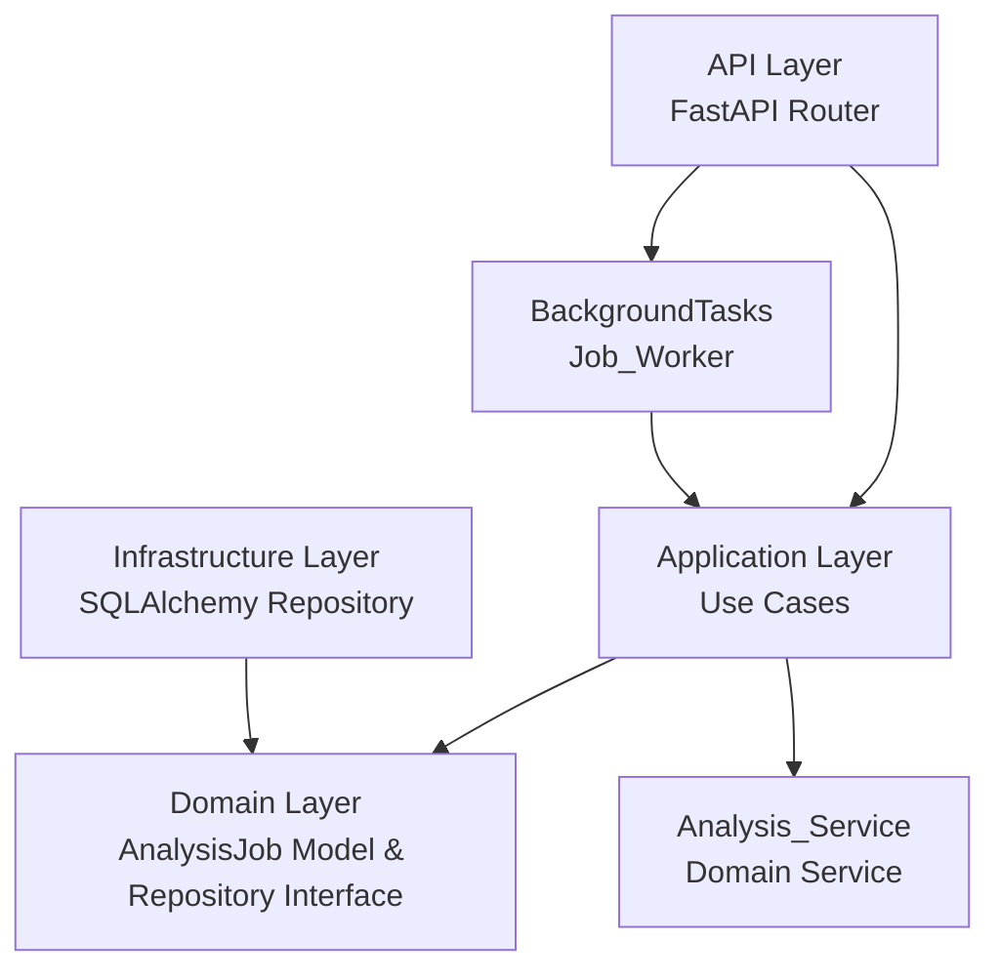
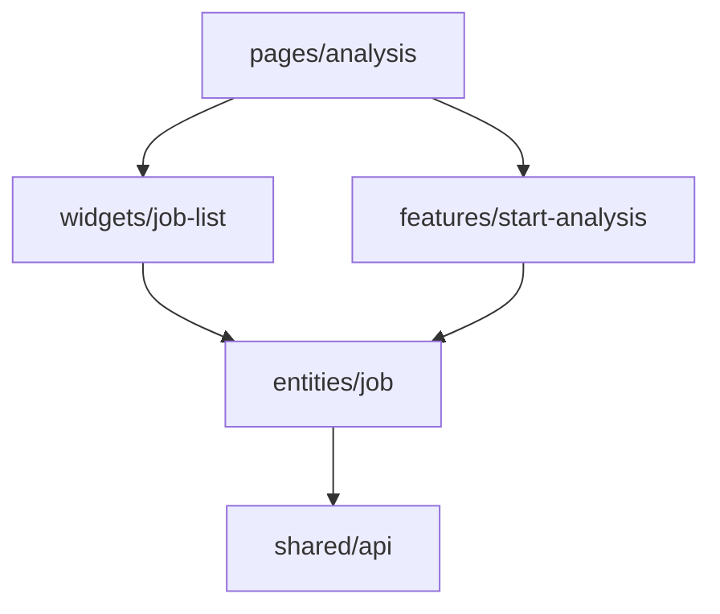
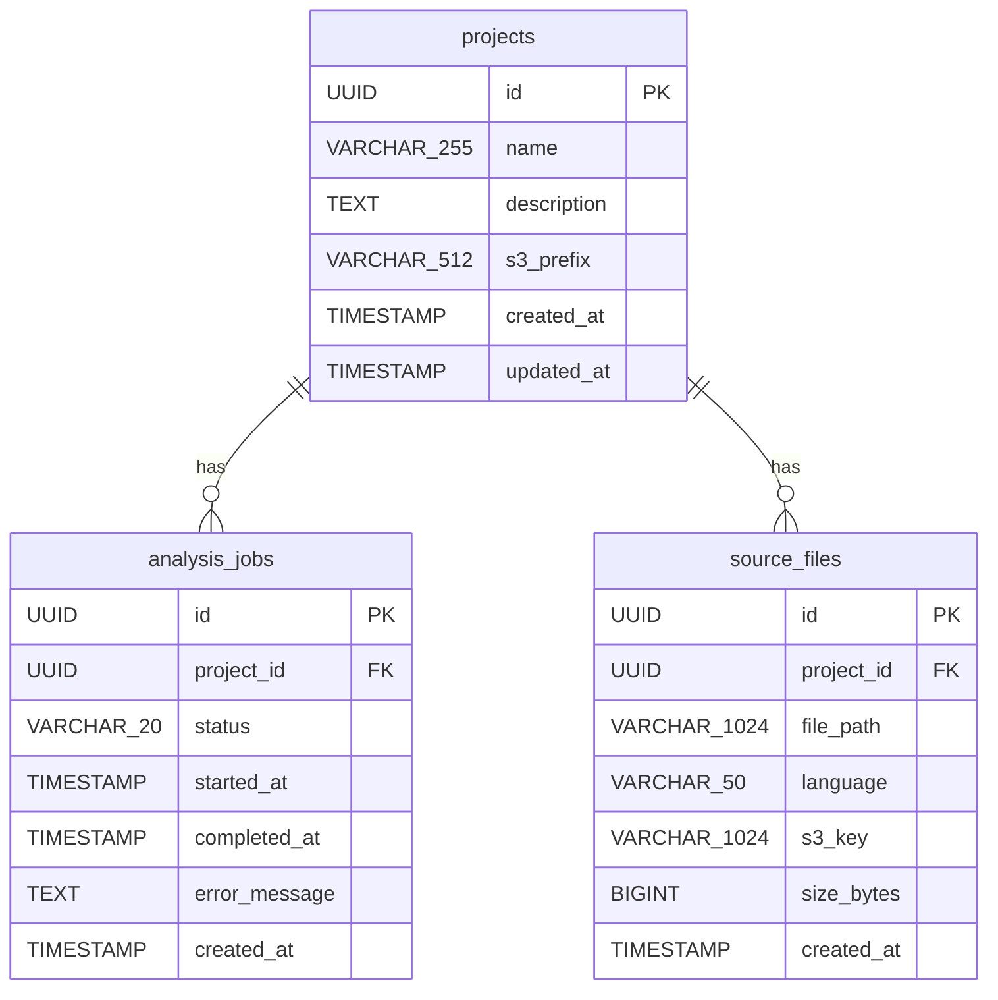

# 設計書: 解析ジョブ管理

## 概要

System Reforgeにおける解析ジョブ管理機能の設計。アップロード済みのソースコードに対して非同期で解析ジョブを作成・実行し、進捗とステータスを管理する。バックエンドはクリーンアーキテクチャ（FastAPI + SQLAlchemy + PostgreSQL + BackgroundTasks）、フロントエンドはFSD（React + Mantine + React Query）で実装する。

project-management仕様およびzip-upload仕様が先に実装されている前提で、projects/source_filesテーブルおよび関連コンポーネントは既存とする。解析処理の実体（パーサー呼び出し、構造化データ生成）はスタブ/プレースホルダーとし、実際のパーサー実装は別仕様で扱う。

## アーキテクチャ

### 処理フロー



### バックエンド（クリーンアーキテクチャ）



依存方向: `api → application → domain ← infrastructure`

### フロントエンド（FSD）



依存方向: `pages → widgets/features → entities → shared`

## コンポーネントとインターフェース

### バックエンド

#### 1. Domain層

**AnalysisJob エンティティ** (`server/domain/models/analysis_job.py`)

```python
from dataclasses import dataclass
from datetime import datetime
from enum import Enum
from uuid import UUID


class JobStatus(str, Enum):
    PENDING = "pending"
    RUNNING = "running"
    COMPLETED = "completed"
    FAILED = "failed"

# 有効なステータス遷移マップ
VALID_TRANSITIONS: dict[JobStatus, set[JobStatus]] = {
    JobStatus.PENDING: {JobStatus.RUNNING},
    JobStatus.RUNNING: {JobStatus.COMPLETED, JobStatus.FAILED},
    JobStatus.COMPLETED: set(),
    JobStatus.FAILED: set(),
}


@dataclass
class AnalysisJob:
    id: UUID
    project_id: UUID
    status: JobStatus
    started_at: datetime | None
    completed_at: datetime | None
    error_message: str | None
    created_at: datetime

    def transition_to(self, new_status: JobStatus) -> None:
        """ステータスを遷移させる。不正な遷移はInvalidStatusTransitionErrorを発生させる。"""
        if new_status not in VALID_TRANSITIONS[self.status]:
            raise InvalidStatusTransitionError(
                f"Cannot transition from {self.status.value} to {new_status.value}"
            )
        self.status = new_status
```

**AnalysisJobRepository インターフェース** (`server/domain/repositories/analysis_job_repository.py`)

```python
class AnalysisJobRepository(ABC):
    async def create(self, job: AnalysisJob) -> AnalysisJob
    async def find_by_id(self, job_id: UUID) -> AnalysisJob | None
    async def find_by_project(self, project_id: UUID) -> list[AnalysisJob]
    async def update(self, job: AnalysisJob) -> None
```

**例外クラス** (`server/domain/exceptions.py` に追加)

```python
class AnalysisJobNotFoundError(Exception):
    pass

class InvalidStatusTransitionError(Exception):
    pass

class NoSourceFilesError(Exception):
    pass
```

#### 2. Application層

**StartAnalysisUseCase** (`server/application/start_analysis.py`)

```python
class StartAnalysisUseCase:
    def __init__(
        self,
        project_repository: ProjectRepository,
        source_file_repository: SourceFileRepository,
        job_repository: AnalysisJobRepository,
    ): ...

    async def execute(self, project_id: UUID) -> AnalysisJob:
        """
        1. プロジェクト存在確認（なければProjectNotFoundError）
        2. ソースファイル存在確認（なければNoSourceFilesError）
        3. AnalysisJob作成（status=pending）
        4. DB保存
        5. AnalysisJobを返却
        """
```

**GetJobUseCase** (`server/application/get_job.py`)

```python
class GetJobUseCase:
    def __init__(self, job_repository: AnalysisJobRepository): ...

    async def execute(self, job_id: UUID) -> AnalysisJob:
        """ジョブ取得。存在しない場合はAnalysisJobNotFoundError。"""
```

**ListJobsUseCase** (`server/application/list_jobs.py`)

```python
class ListJobsUseCase:
    def __init__(
        self,
        project_repository: ProjectRepository,
        job_repository: AnalysisJobRepository,
    ): ...

    async def execute(self, project_id: UUID) -> list[AnalysisJob]:
        """プロジェクト存在確認後、ジョブ一覧をcreated_at降順で返却。"""
```

**RunAnalysisUseCase** (`server/application/run_analysis.py`)

Job_Workerから呼び出されるユースケース。

```python
class RunAnalysisUseCase:
    def __init__(
        self,
        job_repository: AnalysisJobRepository,
        source_file_repository: SourceFileRepository,
        analysis_service: AnalysisService,
    ): ...

    async def execute(self, job_id: UUID) -> None:
        """
        1. ジョブ取得
        2. status → running、started_at設定、DB更新
        3. Analysis_Service呼び出し（構造化中間データ生成）
        4. 成功: status → completed、completed_at設定、DB更新
        5. 失敗: status → failed、error_message設定、DB更新
        """
```

**AnalysisService** (`server/domain/services/analysis_service.py`)

```python
class AnalysisService(ABC):
    async def analyze(self, source_files: list[SourceFile]) -> None:
        """ソースファイルを解析し、構造化中間データを生成する。スタブ実装。"""
```

**StubAnalysisService** (`server/infrastructure/analysis/stub_analysis_service.py`)

```python
class StubAnalysisService(AnalysisService):
    async def analyze(self, source_files: list[SourceFile]) -> None:
        """スタブ実装。実際のパーサー実装は別仕様で扱う。"""
        pass
```

#### 3. Infrastructure層

**SQLAlchemy テーブルモデル** (`server/infrastructure/database/models.py` に追加)

```python
class AnalysisJobModel(Base):
    __tablename__ = "analysis_jobs"
    id = Column(UUID, primary_key=True)
    project_id = Column(UUID, ForeignKey("projects.id"), nullable=False, index=True)
    status = Column(String(20), nullable=False, default="pending", index=True)
    started_at = Column(DateTime, nullable=True)
    completed_at = Column(DateTime, nullable=True)
    error_message = Column(Text, nullable=True)
    created_at = Column(DateTime, nullable=False, server_default=func.now())
```

**SQLAlchemyAnalysisJobRepository** (`server/infrastructure/database/repositories/analysis_job_repository.py`)

- AnalysisJobRepositoryインターフェースの実装
- find_by_projectはcreated_at降順でソート
- AnalysisJobModel ↔ AnalysisJob のマッピング

#### 4. API層

**ジョブルーター** (`server/api/routes/jobs.py`)

| エンドポイント | メソッド | 説明 |
|---------------|---------|------|
| `/api/v1/projects/{project_id}/jobs` | POST | 解析ジョブ作成・開始 |
| `/api/v1/projects/{project_id}/jobs` | GET | ジョブ一覧取得 |
| `/api/v1/jobs/{job_id}` | GET | ジョブ詳細・ステータス取得 |

**Pydanticスキーマ** (`server/api/schemas/job.py`)

```python
class JobResponse(BaseModel):
    id: UUID
    project_id: UUID
    status: str
    started_at: datetime | None
    completed_at: datetime | None
    error_message: str | None
    created_at: datetime

class JobListResponse(BaseModel):
    data: list[JobResponse]

class JobCreateResponse(BaseModel):
    data: JobResponse
```

**Job_Worker** (`server/api/routes/jobs.py` 内)

```python
async def run_analysis_worker(job_id: UUID, ...):
    """BackgroundTasksから呼び出される。RunAnalysisUseCaseを実行する。"""
```

ジョブ作成エンドポイントでBackgroundTasksにrun_analysis_workerを登録する。

### フロントエンド

#### 1. entities/job

**型定義** (`client/app/entities/job/model.ts`)

```typescript
type JobStatus = "pending" | "running" | "completed" | "failed";

interface Job {
  id: string;
  project_id: string;
  status: JobStatus;
  started_at: string | null;
  completed_at: string | null;
  error_message: string | null;
  created_at: string;
}
```

**APIクライアント** (`client/app/entities/job/api.ts`)

```typescript
const jobApi = {
  createJob: (projectId: string) => 
    apiClient.post<{ data: Job }>(`/api/v1/projects/${projectId}/jobs`),
  
  listJobs: (projectId: string) =>
    apiClient.get<{ data: Job[] }>(`/api/v1/projects/${projectId}/jobs`),
  
  getJob: (jobId: string) =>
    apiClient.get<{ data: Job }>(`/api/v1/jobs/${jobId}`),
};
```

**React Queryフック** (`client/app/entities/job/hooks.ts`)

```typescript
function useJobs(projectId: string) {
  // ジョブ一覧取得。refetchInterval: 進行中ジョブがあれば5000ms、なければfalse
}

function useJob(jobId: string) {
  // ジョブ詳細取得。refetchInterval: pending/runningなら5000ms、なければfalse
}

function useCreateJob() {
  // ジョブ作成ミューテーション。成功後にジョブ一覧をinvalidate
}
```

ポーリング制御: React Queryの`refetchInterval`オプションを使用し、ジョブが進行中（pending/running）の場合のみ5秒間隔でポーリングする。completed/failedになったらポーリングを停止する。

#### 2. features/start-analysis

**解析開始機能** (`client/app/features/start-analysis/ui.tsx`)

- 「解析開始」ボタンコンポーネント
- useCreateJobミューテーションを使用
- ローディング中はボタンを無効化
- エラー時にMantine Notificationで通知

#### 3. widgets/job-list

**ジョブ一覧ウィジェット** (`client/app/widgets/job-list/ui.tsx`)

- Mantine Tableでジョブ一覧を表示
- カラム: ステータス、作成日時、開始日時、完了日時、エラーメッセージ
- ステータスバッジの色分け:
  - pending: gray
  - running: blue
  - completed: green（teal）
  - failed: red
- 0件時は空状態メッセージ表示
- ローディング中はSkeleton表示

#### 4. pages/analysis

**解析ページ** (`client/app/pages/analysis/ui.tsx`)

- URLパラメータからproject_idを取得
- Start_Analysisボタン配置
- Job_List_Widget配置
- useJobsフックでジョブ一覧取得（ポーリング付き）

## データモデル

### ER図



### Alembicマイグレーション

analysis_jobsテーブルの作成マイグレーション:

```sql
CREATE TABLE analysis_jobs (
    id UUID PRIMARY KEY,
    project_id UUID NOT NULL REFERENCES projects(id),
    status VARCHAR(20) NOT NULL DEFAULT 'pending',
    started_at TIMESTAMP,
    completed_at TIMESTAMP,
    error_message TEXT,
    created_at TIMESTAMP NOT NULL DEFAULT NOW()
);

CREATE INDEX idx_analysis_jobs_project_id ON analysis_jobs(project_id);
CREATE INDEX idx_analysis_jobs_status ON analysis_jobs(status);
```


## 正当性プロパティ

*プロパティとは、システムのすべての有効な実行において成り立つべき特性や振る舞いのことである。人間が読める仕様と機械的に検証可能な正当性保証の橋渡しとなる。*

### Property 1: ジョブ作成→取得ラウンドトリップ

*任意の*有効なproject_id（ソースファイルが登録済み）に対して、解析ジョブを作成し、返却されたIDで取得した場合、取得結果のproject_id、status（"pending"）、created_atが作成時の値と一致し、started_at、completed_at、error_messageがnullであること。

**Validates: Requirements 1.1, 3.1**

### Property 2: 存在しないIDへのNOT_FOUND

*任意の*ランダムなUUIDに対して、そのIDに対応するリソースが存在しない場合、ジョブ作成（project_id）、ジョブ一覧取得（project_id）、ジョブ詳細取得（job_id）のすべてでエラーコード"NOT_FOUND"が返却されること。

**Validates: Requirements 1.3, 2.2, 3.2**

### Property 3: ソースファイル未登録時の拒否

*任意の*ソースファイルが0件のプロジェクトに対して、解析ジョブ作成を試みた場合、エラーコード"NO_SOURCE_FILES"が返却され、ジョブが作成されないこと。

**Validates: Requirements 1.4**

### Property 4: ジョブ一覧の降順ソート

*任意の*N個のジョブが存在するプロジェクトに対して、ジョブ一覧を取得した場合、返却されたジョブのcreated_atが降順であること。

**Validates: Requirements 2.1**

### Property 5: ステータス遷移の正当性

*任意の*JobStatusペア(from, to)に対して、遷移が成功するのはfrom→toが有効な遷移（pending→running、running→completed、running→failed）の場合のみであり、それ以外の遷移はInvalidStatusTransitionErrorを発生させること。また、running遷移時にstarted_atが設定され、completed遷移時にcompleted_atが設定され、failed遷移時にerror_messageが設定されること。

**Validates: Requirements 4.1, 4.2, 4.3, 5.1, 5.2**

### Property 6: レスポンス形式の統一性

*任意の*Job_APIリクエストに対して、成功レスポンスは`data`キーを含み、エラーレスポンスは`error.code`と`error.message`を含み、一覧レスポンスは`data`配列を含むこと。

**Validates: Requirements 6.1, 6.2, 6.3**

### Property 7: ポーリング制御

*任意の*ジョブステータスに対して、statusが"pending"または"running"の場合はポーリングが有効（refetchInterval=5000ms）であり、"completed"または"failed"の場合はポーリングが無効（refetchInterval=false）であること。

**Validates: Requirements 7.3, 7.4, 7.5**

### Property 8: ジョブ一覧ウィジェットの表示完全性

*任意の*ジョブデータに対して、Job_List_Widgetのレンダリング結果にステータス、作成日時、開始日時、完了日時、エラーメッセージが含まれ、ステータスに応じた正しい色（pending:gray、running:blue、completed:green、failed:red）が適用されること。

**Validates: Requirements 8.1, 8.3**

## エラーハンドリング

### バックエンド

| エラー種別 | HTTPステータス | エラーコード | 対応 |
|-----------|--------------|------------|------|
| プロジェクト未検出 | 404 | NOT_FOUND | "Project not found" メッセージを返却 |
| ジョブ未検出 | 404 | NOT_FOUND | "Analysis job not found" メッセージを返却 |
| ソースファイル未登録 | 422 | NO_SOURCE_FILES | "No source files found for this project" メッセージを返却 |
| 不正なステータス遷移 | 409 | INVALID_STATUS_TRANSITION | 遷移元→遷移先の情報を含むメッセージを返却 |
| DB接続エラー | 500 | INTERNAL_ERROR | エラーログ出力、汎用エラーメッセージを返却 |
| ワーカー実行エラー | — | — | ジョブのstatusをfailedに更新、error_messageにエラー内容を記録 |

**例外クラス** (`server/domain/exceptions.py` に追加)

```python
class AnalysisJobNotFoundError(Exception):
    pass

class InvalidStatusTransitionError(Exception):
    pass

class NoSourceFilesError(Exception):
    pass
```

**例外ハンドラ** (`server/api/error_handlers.py` に追加)
- AnalysisJobNotFoundError → 404レスポンス
- NoSourceFilesError → 422レスポンス
- InvalidStatusTransitionError → 409レスポンス

### フロントエンド

- API通信エラー: React Queryのエラーハンドリングで表示（Mantine Notification）
- ネットワークエラー: React Queryのリトライ機能（デフォルト3回）
- ポーリングエラー: エラー発生時もポーリングを継続し、UIにエラー状態を表示

## テスト戦略

### バックエンド

**プロパティベーステスト（pytest + Hypothesis）**
- 各正当性プロパティに対して1つのプロパティベーステストを実装
- 最低100イテレーション/テスト
- タグ形式: `Feature: analysis-job, Property N: {property_text}`
- ドメイン層（ステータス遷移）を重点的にテスト

**ユニットテスト（pytest）**
- ユースケースのエッジケース
- ワーカーの成功/失敗パス
- エラーハンドリングの確認
- リポジトリのモックを使用

**統合テスト（pytest + httpx）**
- APIエンドポイントのE2Eテスト
- テスト用PostgreSQLを使用

### フロントエンド

**プロパティベーステスト（Vitest + fast-check）**
- ポーリング制御ロジックのプロパティテスト
- ステータス色マッピングのプロパティテスト
- 最低100イテレーション/テスト

**ユニットテスト（Vitest + React Testing Library）**
- コンポーネントの表示テスト
- ユーザーインタラクションテスト（解析開始ボタン）
- ポーリング動作テスト
- APIモックを使用（MSW）

### テストライブラリ

| レイヤー | テストフレームワーク | PBTライブラリ |
|---------|-------------------|-------------|
| バックエンド | pytest | Hypothesis |
| フロントエンド | Vitest | fast-check |
