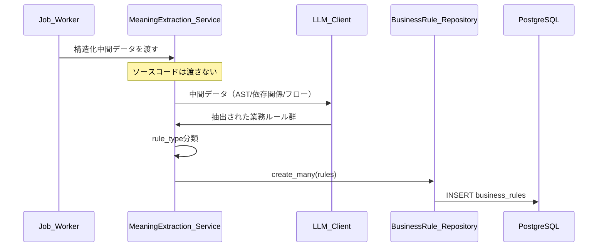
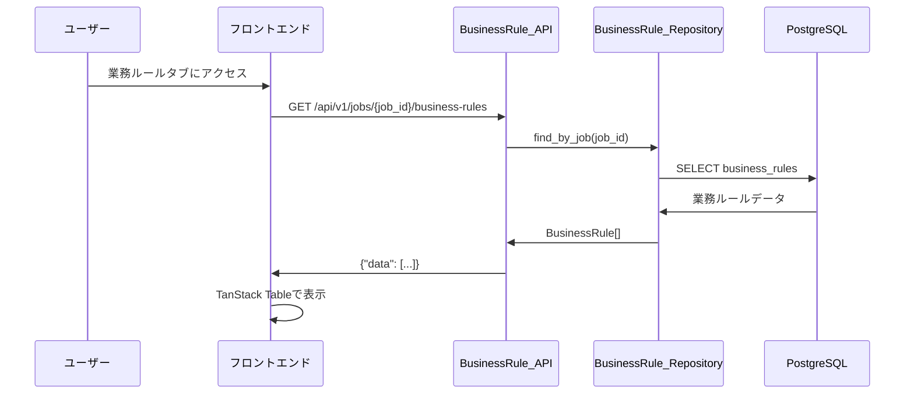
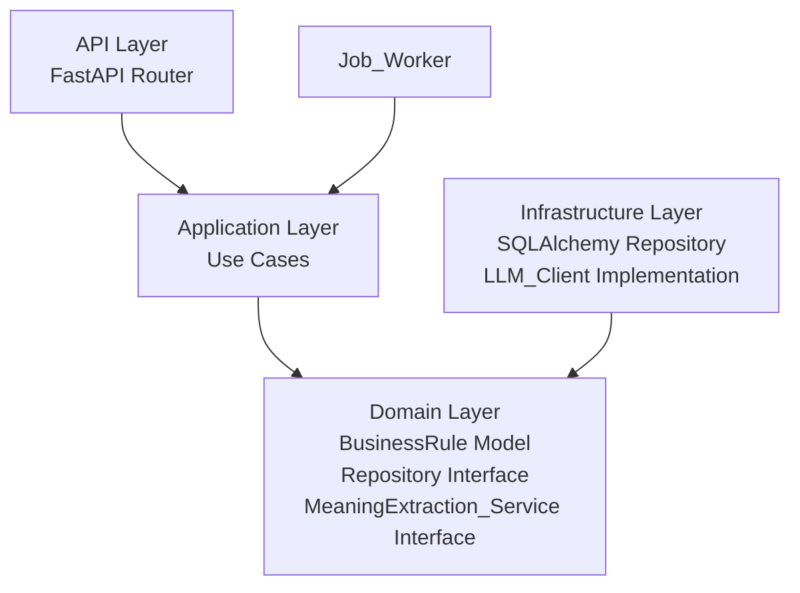
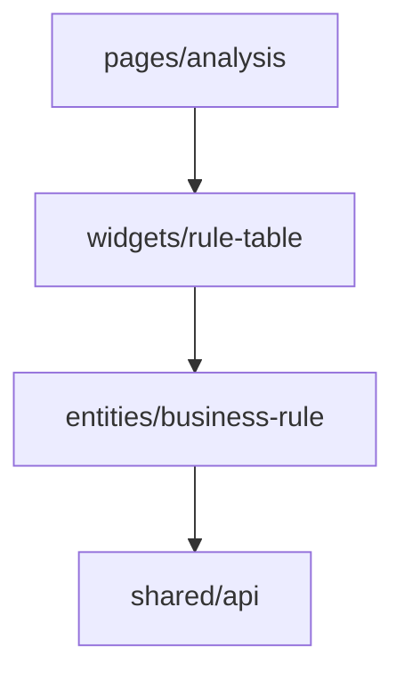
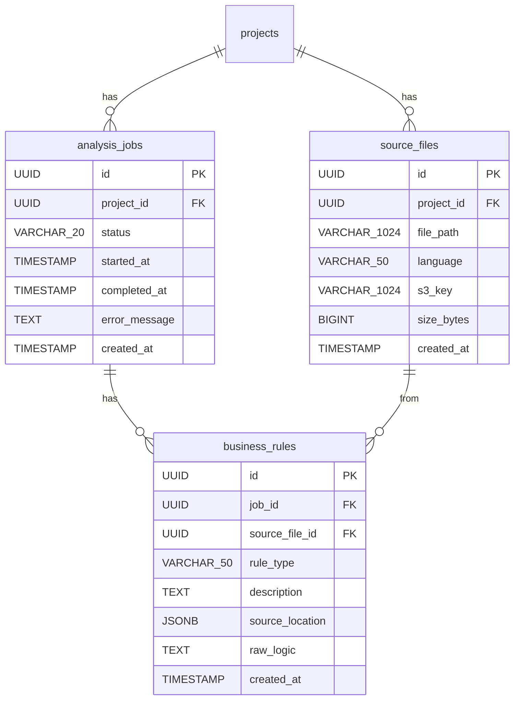

# 設計書: 業務ルール抽出

## 概要

System Reforgeにおける業務ルール抽出機能の設計。解析ジョブの結果として生成された構造化中間データ（AST、依存関係、フロー情報）からLLMを使用して業務ルール（条件分岐・計算ロジック・バリデーション）を抽出し、自然言語で記述する。

バックエンドはクリーンアーキテクチャ（FastAPI + SQLAlchemy + PostgreSQL + httpx）で業務ルール抽出・API提供を、フロントエンドはFSD（React + Mantine + TanStack Table）で業務ルール一覧表示を実装する。

前提条件:
- project-management、zip-upload、analysis-job、dependency-visualization仕様が実装済み
- analysis_jobs、source_files、dependency_edgesテーブルは既存
- 解析ジョブ完了時に構造化中間データがDBに保存されている
- Amazon Bedrock を既定のLLMプロバイダとし、開発時はスタブ実装へフォールバック可能とする

重要な制約:
- LLMにソースコードを直接渡さない
- 構造化された中間データ（AST、依存関係、フロー情報）のみをLLMへの入力とする
- LLMは意味抽出専用（コード生成・変換には使わない）

## アーキテクチャ

### 処理フロー





### バックエンド（クリーンアーキテクチャ）



依存方向: `api → application → domain ← infrastructure`

### フロントエンド（FSD）



依存方向: `pages → widgets → entities → shared`

## コンポーネントとインターフェース

### バックエンド

#### 1. Domain層

**RuleType 列挙型** (`server/domain/models/business_rule.py`)

```python
from enum import Enum

class RuleType(str, Enum):
    CONDITION = "condition"
    CALCULATION = "calculation"
    VALIDATION = "validation"
```

**BusinessRule エンティティ** (`server/domain/models/business_rule.py`)

```python
from dataclasses import dataclass
from datetime import datetime
from uuid import UUID

@dataclass
class BusinessRule:
    id: UUID
    job_id: UUID
    source_file_id: UUID | None
    rule_type: RuleType
    description: str
    source_location: dict | None  # {"line_start": int, "line_end": int, "section": str}
    raw_logic: str | None
    created_at: datetime

    def __post_init__(self) -> None:
        if not self.description or not self.description.strip():
            raise ValueError("description must not be empty")
```

**BusinessRuleRepository インターフェース** (`server/domain/repositories/business_rule_repository.py`)

```python
from abc import ABC, abstractmethod
from uuid import UUID

class BusinessRuleRepository(ABC):
    @abstractmethod
    async def create_many(self, rules: list[BusinessRule]) -> list[BusinessRule]:
        """業務ルールを一括作成する。"""

    @abstractmethod
    async def find_by_job(self, job_id: UUID, rule_type: RuleType | None = None) -> list[BusinessRule]:
        """指定ジョブの業務ルールを取得する。rule_type指定時はフィルタリング。created_at昇順。"""
```

**MeaningExtractionService インターフェース** (`server/domain/services/meaning_extraction_service.py`)

```python
from abc import ABC, abstractmethod
from dataclasses import dataclass

@dataclass
class IntermediateData:
    """構造化中間データ。LLMへの入力として使用される。"""
    job_id: UUID
    source_file_id: UUID | None
    ast_data: dict          # AST構造
    dependency_data: dict   # 依存関係情報
    flow_data: dict         # フロー情報

@dataclass
class ExtractedRule:
    """LLMから抽出された業務ルール（未永続化）。"""
    rule_type: str          # "condition" / "calculation" / "validation"
    description: str
    source_location: dict | None
    raw_logic: str | None

class MeaningExtractionService(ABC):
    @abstractmethod
    async def extract_rules(self, intermediate_data: list[IntermediateData]) -> list[ExtractedRule]:
        """構造化中間データから業務ルールを抽出する。"""
```

**LLMClient インターフェース** (`server/domain/services/llm_client.py`)

```python
from abc import ABC, abstractmethod

class LLMClient(ABC):
    @abstractmethod
    async def extract_business_rules(self, intermediate_data: IntermediateData) -> list[ExtractedRule]:
        """構造化中間データから業務ルールを抽出する。ソースコードは受け取らない。"""
```

#### 2. Application層

**ExtractBusinessRulesUseCase** (`server/application/analysis/extract_business_rules.py`)

```python
class ExtractBusinessRulesUseCase:
    def __init__(
        self,
        job_repository: AnalysisJobRepository,
        business_rule_repository: BusinessRuleRepository,
        meaning_extraction_service: MeaningExtractionService,
    ): ...

    async def execute(self, job_id: UUID, intermediate_data: list[IntermediateData]) -> list[BusinessRule]:
        """
        1. ジョブ存在確認（なければAnalysisJobNotFoundError）
        2. MeaningExtractionServiceで業務ルール抽出
        3. ExtractedRule → BusinessRuleに変換（UUID生成、タイムスタンプ設定）
        4. BusinessRuleRepositoryで一括保存
        5. 保存された業務ルールを返却
        """
```

**GetBusinessRulesUseCase** (`server/application/analysis/get_business_rules.py`)

```python
class GetBusinessRulesUseCase:
    def __init__(
        self,
        job_repository: AnalysisJobRepository,
        business_rule_repository: BusinessRuleRepository,
    ): ...

    async def execute(self, job_id: UUID, rule_type: RuleType | None = None) -> list[BusinessRule]:
        """
        1. ジョブ存在確認（なければAnalysisJobNotFoundError）
        2. 業務ルール一覧取得（rule_typeフィルタ対応）
        3. created_at昇順で返却
        """
```

#### 3. Infrastructure層

**SQLAlchemy テーブルモデル** (`server/infrastructure/database/models.py` に追加)

```python
class BusinessRuleModel(Base):
    __tablename__ = "business_rules"
    id = Column(UUID, primary_key=True)
    job_id = Column(UUID, ForeignKey("analysis_jobs.id"), nullable=False, index=True)
    source_file_id = Column(UUID, ForeignKey("source_files.id"), nullable=True, index=True)
    rule_type = Column(String(50), nullable=False)
    description = Column(Text, nullable=False)
    source_location = Column(JSONB, nullable=True)
    raw_logic = Column(Text, nullable=True)
    created_at = Column(DateTime, nullable=False, server_default=func.now())
```

**SQLAlchemyBusinessRuleRepository** (`server/infrastructure/database/repositories/business_rule_repository.py`)

- BusinessRuleRepositoryインターフェースの実装
- find_by_jobはcreated_at昇順でソート、rule_typeフィルタ対応
- BusinessRuleModel ↔ BusinessRule のマッピング

**LLMクライアント実装** (`server/infrastructure/llm/llm_client.py`)

```python
class StubLLMClient(LLMClient):
    """スタブ実装。固定の業務ルールデータを返却する。"""

    async def extract_business_rules(self, intermediate_data: IntermediateData) -> list[ExtractedRule]:
        return [
            ExtractedRule(
                rule_type="condition",
                description="IF 顧客区分 = 'VIP' THEN 割引率 = 20%",
                source_location={"line_start": 100, "line_end": 110, "section": "PROCEDURE DIVISION"},
                raw_logic="IF WS-CUSTOMER-TYPE = 'VIP' MOVE 20 TO WS-DISCOUNT-RATE",
            ),
            ExtractedRule(
                rule_type="calculation",
                description="合計金額 = 単価 × 数量 × (1 - 割引率 / 100)",
                source_location={"line_start": 200, "line_end": 205, "section": "PROCEDURE DIVISION"},
                raw_logic="COMPUTE WS-TOTAL = WS-PRICE * WS-QTY * (1 - WS-DISCOUNT / 100)",
            ),
            ExtractedRule(
                rule_type="validation",
                description="数量は1以上9999以下であること",
                source_location={"line_start": 50, "line_end": 55, "section": "PROCEDURE DIVISION"},
                raw_logic="IF WS-QTY < 1 OR WS-QTY > 9999 PERFORM ERROR-ROUTINE",
            ),
        ]


class BedrockLLMClient(LLMClient):
    """Amazon Bedrock を利用する実装。未設定時はDIでスタブへフォールバックする。"""
```

**DefaultMeaningExtractionService** (`server/infrastructure/llm/meaning_extraction_service.py`)

```python
class DefaultMeaningExtractionService(MeaningExtractionService):
    def __init__(self, llm_client: LLMClient): ...

    async def extract_rules(self, intermediate_data: list[IntermediateData]) -> list[ExtractedRule]:
        """
        各IntermediateDataに対してLLMClientを呼び出し、結果を集約する。
        エラー発生時は抽出済みルールを保持し、エラーをログに記録する。
        """
        all_rules: list[ExtractedRule] = []
        for data in intermediate_data:
            try:
                rules = await self.llm_client.extract_business_rules(data)
                all_rules.extend(rules)
            except Exception as e:
                logger.error(f"LLM extraction failed for {data.source_file_id}: {e}")
                # 抽出済みルールは保持、処理を継続
        return all_rules
```

#### 4. API層

**業務ルールルーター** (`server/api/routes/analysis.py` に追加)

| エンドポイント | メソッド | 説明 |
|---------------|---------|------|
| `/api/v1/jobs/{job_id}/business-rules` | GET | 業務ルール一覧取得（rule_typeフィルタ対応） |

**Pydanticスキーマ** (`server/api/schemas/business_rule.py`)

```python
class SourceLocationSchema(BaseModel):
    line_start: int | None = None
    line_end: int | None = None
    section: str | None = None

class BusinessRuleResponse(BaseModel):
    id: str
    job_id: str
    source_file_id: str | None
    rule_type: str
    description: str
    source_location: SourceLocationSchema | None
    raw_logic: str | None
    created_at: datetime

class BusinessRuleListResponse(BaseModel):
    data: list[BusinessRuleResponse]
```

### フロントエンド

#### 1. entities/business-rule

**型定義** (`client/app/entities/business-rule/model.ts`)

```typescript
type RuleType = "condition" | "calculation" | "validation";

interface SourceLocation {
  line_start: number | null;
  line_end: number | null;
  section: string | null;
}

interface BusinessRule {
  id: string;
  job_id: string;
  source_file_id: string | null;
  rule_type: RuleType;
  description: string;
  source_location: SourceLocation | null;
  raw_logic: string | null;
  created_at: string;
}
```

**APIクライアント** (`client/app/entities/business-rule/api.ts`)

```typescript
const businessRuleApi = {
  listByJob: (jobId: string, ruleType?: RuleType) => {
    const params = ruleType ? `?rule_type=${ruleType}` : "";
    return apiClient.get<{ data: BusinessRule[] }>(
      `/api/v1/jobs/${jobId}/business-rules${params}`
    );
  },
};
```

**React Queryフック** (`client/app/entities/business-rule/hooks.ts`)

```typescript
function useBusinessRules(jobId: string, ruleType?: RuleType) {
  return useQuery({
    queryKey: ["business-rules", jobId, ruleType],
    queryFn: () => businessRuleApi.listByJob(jobId, ruleType),
  });
}
```

#### 2. widgets/rule-table

**業務ルールテーブルウィジェット** (`client/app/widgets/rule-table/ui.tsx`)

TanStack Tableを使用した業務ルール一覧テーブル。

```typescript
// カラム定義
const columns: ColumnDef<BusinessRule>[] = [
  {
    accessorKey: "rule_type",
    header: "種別",
    cell: ({ getValue }) => <RuleTypeBadge type={getValue()} />,
    filterFn: "equals",
  },
  {
    accessorKey: "description",
    header: "説明",
  },
  {
    accessorKey: "source_file_id",
    header: "ソースファイル",
    cell: ({ getValue }) => <SourceFileName fileId={getValue()} />,
  },
  {
    accessorKey: "source_location",
    header: "位置",
    cell: ({ getValue }) => formatSourceLocation(getValue()),
  },
];
```

**RuleTypeBadge コンポーネント** (`client/app/widgets/rule-table/ui/RuleTypeBadge.tsx`)

```typescript
const RULE_TYPE_COLORS: Record<RuleType, string> = {
  condition: "blue",
  calculation: "green",
  validation: "orange",
};

function RuleTypeBadge({ type }: { type: RuleType }) {
  return <Badge color={RULE_TYPE_COLORS[type]}>{type}</Badge>;
}
```

**フィルタリング**: TanStack Tableのカラムフィルタ機能を使用。rule_typeカラムにSegmentedControlまたはSelectでフィルタUIを提供。

**ソート**: TanStack Tableのソート機能を使用。カラムヘッダークリックで昇順・降順を切り替え。

#### 3. pages/analysis（既存ページに追加）

解析結果ページに業務ルールタブを追加。Mantine Tabsを使用。

```typescript
// 既存の解析ページにタブを追加
<Tabs defaultValue="jobs">
  <Tabs.List>
    <Tabs.Tab value="jobs">ジョブ一覧</Tabs.Tab>
    <Tabs.Tab value="dependencies">依存関係</Tabs.Tab>
    <Tabs.Tab value="business-rules">業務ルール</Tabs.Tab>
  </Tabs.List>
  <Tabs.Panel value="business-rules">
    <RuleTableWidget jobId={selectedJobId} />
  </Tabs.Panel>
</Tabs>
```

## データモデル

### ER図



### Alembicマイグレーション

business_rulesテーブルの作成マイグレーション:

```sql
CREATE TABLE business_rules (
    id UUID PRIMARY KEY,
    job_id UUID NOT NULL REFERENCES analysis_jobs(id),
    source_file_id UUID REFERENCES source_files(id),
    rule_type VARCHAR(50) NOT NULL,
    description TEXT NOT NULL,
    source_location JSONB,
    raw_logic TEXT,
    created_at TIMESTAMP NOT NULL DEFAULT NOW()
);

CREATE INDEX idx_business_rules_job_id ON business_rules(job_id);
CREATE INDEX idx_business_rules_source_file_id ON business_rules(source_file_id);
```

## 正当性プロパティ

*プロパティとは、システムのすべての有効な実行において成り立つべき特性や振る舞いのことである。人間が読める仕様と機械的に検証可能な正当性保証の橋渡しとなる。*

### Property 1: 抽出→保存→取得ラウンドトリップ

*任意の*有効な構造化中間データに対して、MeaningExtraction_Serviceで業務ルールを抽出し、BusinessRule_Repositoryで保存した後、find_by_jobで取得した場合、抽出されたルールの数と内容（rule_type、description）が一致し、各ルールに有効なrule_type（condition / calculation / validation）が設定されていること。

**Validates: Requirements 1.1, 1.3, 1.5**

### Property 2: LLMへのソースコード非送信

*任意の*IntermediateDataに対して、MeaningExtraction_ServiceがLLM_Clientに渡すデータにはast_data、dependency_data、flow_dataのみが含まれ、ソースコード本体が含まれないこと。

**Validates: Requirements 1.2**

### Property 3: LLMエラー時の部分結果保持

*任意の*N個のIntermediateDataに対して、K番目（K < N）のLLM呼び出しでエラーが発生した場合、1〜K-1番目の抽出結果が保持され、K+1〜N番目の処理が継続されること。

**Validates: Requirements 1.4**

### Property 4: 存在しないjob_idへのNOT_FOUND

*任意の*ランダムなUUIDに対して、そのIDに対応するジョブが存在しない場合、業務ルール一覧取得APIでエラーコード"NOT_FOUND"が返却されること。

**Validates: Requirements 3.2**

### Property 5: 業務ルール一覧の昇順ソート

*任意の*N個の業務ルールが存在するジョブに対して、業務ルール一覧を取得した場合、返却されたルールのcreated_atが昇順であること。

**Validates: Requirements 3.1**

### Property 6: APIのrule_typeフィルタリング

*任意の*業務ルール集合と*任意の*rule_typeフィルタに対して、フィルタ適用後の結果は指定されたrule_typeのルールのみを含み、元の集合における該当rule_typeのルール数と一致すること。

**Validates: Requirements 3.4**

### Property 7: ドメインモデルバリデーション

*任意の*rule_type文字列に対して、BusinessRuleの生成が成功するのはrule_typeが"condition"・"calculation"・"validation"のいずれかの場合のみであること。また、*任意の*空文字列またはホワイトスペースのみのdescriptionに対して、BusinessRuleの生成がValueErrorを発生させること。

**Validates: Requirements 4.2, 4.3**

### Property 8: レスポンス形式の統一性

*任意の*BusinessRule_APIリクエストに対して、成功レスポンスは`data`配列を含み、エラーレスポンスは`error.code`と`error.message`を含むこと。

**Validates: Requirements 5.1, 5.2**

### Property 9: テーブル表示の完全性

*任意の*BusinessRuleデータに対して、Rule_Table_Widgetのレンダリング結果にrule_type、description、ソースファイル情報、source_locationが含まれ、rule_typeに応じた正しいバッジ色（condition:blue、calculation:green、validation:orange）が適用されること。

**Validates: Requirements 6.2, 6.3**

### Property 10: UIフィルタリングのラウンドトリップ

*任意の*業務ルール集合と*任意の*選択されたrule_type集合に対して、フィルタ適用後のテーブルは選択されたタイプのルールのみを含み、フィルタ解除後は元の全ルールが復元されること。

**Validates: Requirements 7.1, 7.2**

## エラーハンドリング

### バックエンド

| エラー種別 | HTTPステータス | エラーコード | 対応 |
|-----------|--------------|------------|------|
| ジョブ未検出 | 404 | NOT_FOUND | "Analysis job not found" メッセージを返却 |
| 無効なrule_type | 422 | VALIDATION_ERROR | "Invalid rule_type" メッセージを返却 |
| LLM通信エラー | — | — | ログ出力、抽出済みルールは保持、処理継続 |
| DB接続エラー | 500 | INTERNAL_ERROR | エラーログ出力、汎用エラーメッセージを返却 |

既存の例外クラス（`server/domain/exceptions.py`）を再利用:
- `AnalysisJobNotFoundError` → 404レスポンス（analysis-job仕様で定義済み）

### フロントエンド

- API通信エラー: React Queryのエラーハンドリングで表示（Mantine Notification）
- ネットワークエラー: React Queryのリトライ機能（デフォルト3回）
- 空データ: 業務ルール0件時に空状態メッセージを表示

## テスト戦略

### バックエンド

**プロパティベーステスト（pytest + Hypothesis）**
- 各正当性プロパティに対して1つのプロパティベーステストを実装
- 最低100イテレーション/テスト
- タグ形式: `Feature: business-rule-extraction, Property N: {property_text}`
- ドメイン層（BusinessRuleバリデーション）とApplication層（抽出ロジック、フィルタリング）を重点的にテスト

**ユニットテスト（pytest）**
- ユースケースのエッジケース（空データ、LLMエラー）
- DefaultMeaningExtractionServiceのエラーハンドリング
- リポジトリのモックを使用

**統合テスト（pytest + httpx）**
- APIエンドポイントのE2Eテスト
- テスト用PostgreSQLを使用

### フロントエンド

**プロパティベーステスト（Vitest + fast-check）**
- フィルタリングロジックのプロパティテスト
- バッジ色マッピングのプロパティテスト
- 最低100イテレーション/テスト

**ユニットテスト（Vitest + React Testing Library）**
- コンポーネントの表示テスト（テーブル、空状態）
- フィルタUIのインタラクションテスト
- APIモックを使用（MSW）

### テストライブラリ

| レイヤー | テストフレームワーク | PBTライブラリ |
|---------|-------------------|-------------|
| バックエンド | pytest | Hypothesis |
| フロントエンド | Vitest | fast-check |
