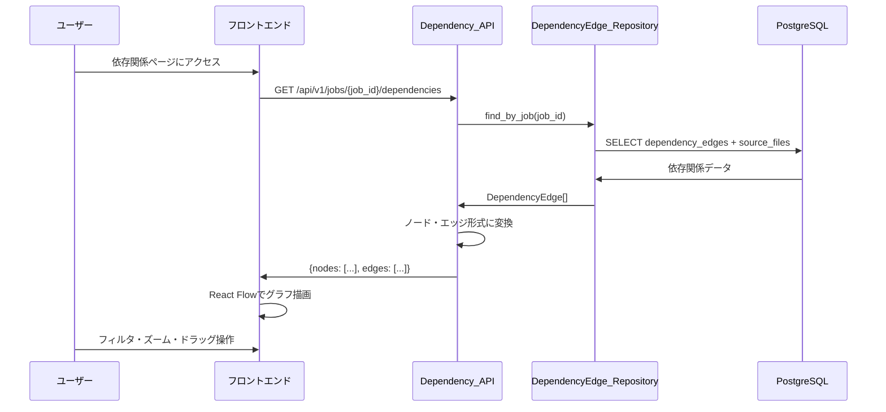
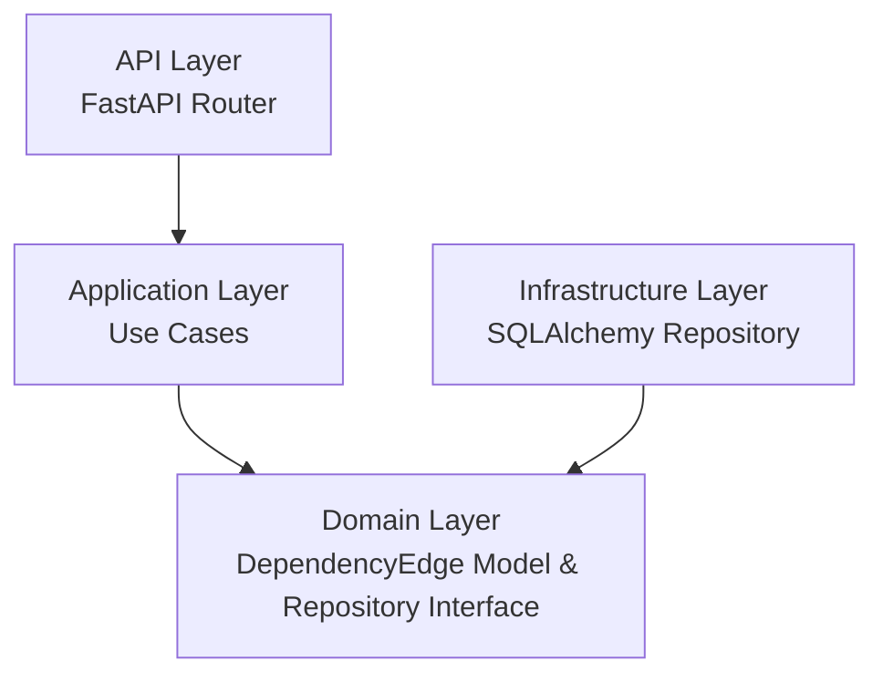
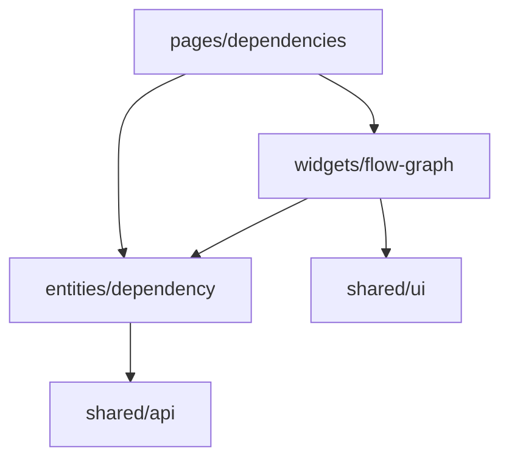
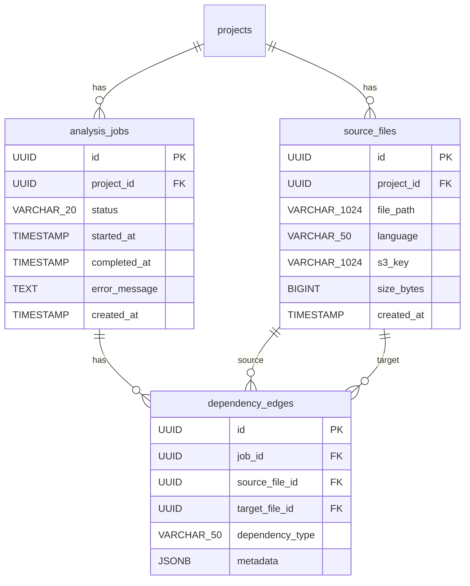

# 設計書: 依存関係・フロー可視化

## 概要

System Reforgeにおける依存関係・フロー可視化機能の設計。解析ジョブの結果として生成された依存関係データ（DependencyEdge）をReact Flowでグラフ表示し、プログラム間の呼び出し関係と処理フローを可視化する。

バックエンドはクリーンアーキテクチャ（FastAPI + SQLAlchemy + PostgreSQL）で依存関係データのAPI提供を、フロントエンドはFSD（React + Mantine + React Flow）でインタラクティブなグラフ可視化を実装する。

前提条件:
- project-management、zip-upload、analysis-job仕様が実装済み
- analysis_jobs、source_filesテーブルは既存
- 解析ジョブ完了時に依存関係データがDBに保存される（解析処理自体は別仕様）

## アーキテクチャ

### 処理フロー



### バックエンド（クリーンアーキテクチャ）



依存方向: `api → application → domain ← infrastructure`

### フロントエンド（FSD）



依存方向: `pages → widgets → entities → shared`

## コンポーネントとインターフェース

### バックエンド

#### 1. Domain層

**DependencyType 列挙型** (`server/app/domain/models/dependency_edge.py`)

```python
from enum import Enum

class DependencyType(str, Enum):
    CALL = "CALL"
    COPY = "COPY"
    INCLUDE = "INCLUDE"
```

**DependencyEdge エンティティ** (`server/app/domain/models/dependency_edge.py`)

```python
from dataclasses import dataclass
from uuid import UUID

@dataclass
class DependencyEdge:
    id: UUID
    job_id: UUID
    source_file_id: UUID
    target_file_id: UUID
    dependency_type: DependencyType
    metadata: dict | None
```

**DependencyEdgeRepository インターフェース** (`server/app/domain/repositories/dependency_edge_repository.py`)

```python
from abc import ABC, abstractmethod
from uuid import UUID

class DependencyEdgeRepository(ABC):
    @abstractmethod
    async def find_by_job(self, job_id: UUID) -> list[DependencyEdge]:
        """指定ジョブの全依存関係を取得する。"""

    @abstractmethod
    async def create_many(self, edges: list[DependencyEdge]) -> list[DependencyEdge]:
        """依存関係を一括作成する。"""
```

#### 2. Application層

**GetDependencyGraphUseCase** (`server/app/application/analysis/get_dependency_graph.py`)

```python
class GetDependencyGraphUseCase:
    def __init__(
        self,
        job_repository: AnalysisJobRepository,
        dependency_edge_repository: DependencyEdgeRepository,
        source_file_repository: SourceFileRepository,
    ): ...

    async def execute(self, job_id: UUID) -> DependencyGraphResult:
        """
        1. ジョブ存在確認（なければAnalysisJobNotFoundError）
        2. 依存関係データ取得
        3. 関連ソースファイル取得
        4. ノード・エッジ形式に変換して返却
        """
```

**DependencyGraphResult** (`server/app/application/analysis/get_dependency_graph.py`)

```python
@dataclass
class GraphNode:
    id: str
    file_path: str
    language: str

@dataclass
class GraphEdge:
    id: str
    source: str  # source_file_id
    target: str  # target_file_id
    dependency_type: str
    metadata: dict | None

@dataclass
class DependencyGraphResult:
    nodes: list[GraphNode]
    edges: list[GraphEdge]
```

**GetFlowDataUseCase** (`server/app/application/analysis/get_flow_data.py`)

```python
class GetFlowDataUseCase:
    def __init__(
        self,
        job_repository: AnalysisJobRepository,
        dependency_edge_repository: DependencyEdgeRepository,
        source_file_repository: SourceFileRepository,
    ): ...

    async def execute(self, job_id: UUID) -> FlowDataResult:
        """
        1. ジョブ存在確認
        2. 依存関係データ取得
        3. ツリー構造（呼び出し階層）に変換
        4. ルートノード（他から呼ばれないファイル）を起点にツリー構築
        """
```

**FlowDataResult** (`server/app/application/analysis/get_flow_data.py`)

```python
@dataclass
class FlowNode:
    id: str
    file_path: str
    language: str
    children: list["FlowNode"]

@dataclass
class FlowDataResult:
    roots: list[FlowNode]
```

**GetSourceFilesForJobUseCase** (`server/app/application/analysis/get_source_files_for_job.py`)

```python
class GetSourceFilesForJobUseCase:
    def __init__(
        self,
        job_repository: AnalysisJobRepository,
        source_file_repository: SourceFileRepository,
    ): ...

    async def execute(self, job_id: UUID) -> list[SourceFile]:
        """
        1. ジョブ存在確認
        2. ジョブのproject_idからソースファイル一覧取得
        """
```

#### 3. Infrastructure層

**SQLAlchemy テーブルモデル** (`server/app/infrastructure/database/models.py` に追加)

```python
class DependencyEdgeModel(Base):
    __tablename__ = "dependency_edges"
    id = Column(UUID, primary_key=True)
    job_id = Column(UUID, ForeignKey("analysis_jobs.id"), nullable=False, index=True)
    source_file_id = Column(UUID, ForeignKey("source_files.id"), nullable=False)
    target_file_id = Column(UUID, ForeignKey("source_files.id"), nullable=False)
    dependency_type = Column(String(50), nullable=False)
    metadata = Column(JSONB, nullable=True)
```

**SQLAlchemyDependencyEdgeRepository** (`server/app/infrastructure/database/repositories/dependency_edge_repository.py`)

- DependencyEdgeRepositoryインターフェースの実装
- find_by_jobはjob_idでフィルタ
- DependencyEdgeModel ↔ DependencyEdge のマッピング

#### 4. API層

**依存関係ルーター** (`server/app/api/routes/analysis.py` に追加)

| エンドポイント | メソッド | 説明 |
|---------------|---------|------|
| `/api/v1/jobs/{job_id}/source-files` | GET | ソースファイル一覧取得 |
| `/api/v1/jobs/{job_id}/dependencies` | GET | 依存関係グラフデータ取得 |
| `/api/v1/jobs/{job_id}/flow` | GET | 処理フローデータ取得 |

**Pydanticスキーマ** (`server/app/api/schemas/analysis.py` に追加)

```python
class GraphNodeResponse(BaseModel):
    id: str
    file_path: str
    language: str

class GraphEdgeResponse(BaseModel):
    id: str
    source: str
    target: str
    dependency_type: str
    metadata: dict | None

class DependencyGraphResponse(BaseModel):
    data: DependencyGraphData

class DependencyGraphData(BaseModel):
    nodes: list[GraphNodeResponse]
    edges: list[GraphEdgeResponse]

class FlowNodeResponse(BaseModel):
    id: str
    file_path: str
    language: str
    children: list["FlowNodeResponse"]

class FlowDataResponse(BaseModel):
    data: FlowDataData

class FlowDataData(BaseModel):
    roots: list[FlowNodeResponse]

class SourceFileResponse(BaseModel):
    id: str
    file_path: str
    language: str
    s3_key: str
    size_bytes: int

class SourceFileListResponse(BaseModel):
    data: list[SourceFileResponse]
```

### フロントエンド

#### 1. entities/dependency

**型定義** (`client/app/entities/dependency/model.ts`)

```typescript
type DependencyType = "CALL" | "COPY" | "INCLUDE";

interface GraphNode {
  id: string;
  file_path: string;
  language: string;
}

interface GraphEdge {
  id: string;
  source: string;
  target: string;
  dependency_type: DependencyType;
  metadata: Record<string, unknown> | null;
}

interface DependencyGraph {
  nodes: GraphNode[];
  edges: GraphEdge[];
}

interface FlowNode {
  id: string;
  file_path: string;
  language: string;
  children: FlowNode[];
}

interface FlowData {
  roots: FlowNode[];
}
```

**APIクライアント** (`client/app/entities/dependency/api.ts`)

```typescript
const dependencyApi = {
  getDependencies: (jobId: string) =>
    apiClient.get<{ data: DependencyGraph }>(`/api/v1/jobs/${jobId}/dependencies`),

  getFlow: (jobId: string) =>
    apiClient.get<{ data: FlowData }>(`/api/v1/jobs/${jobId}/flow`),

  getSourceFiles: (jobId: string) =>
    apiClient.get<{ data: SourceFile[] }>(`/api/v1/jobs/${jobId}/source-files`),
};
```

**React Queryフック** (`client/app/entities/dependency/hooks.ts`)

```typescript
function useDependencyGraph(jobId: string) {
  // 依存関係グラフデータ取得
}

function useFlowData(jobId: string) {
  // 処理フローデータ取得
}

function useSourceFiles(jobId: string) {
  // ソースファイル一覧取得
}
```

#### 2. widgets/flow-graph

**React Flowノード・エッジ変換** (`client/app/widgets/flow-graph/lib/transform.ts`)

GraphNode/GraphEdgeからReact FlowのNode/Edge型への変換ロジック。

```typescript
function toReactFlowNodes(nodes: GraphNode[]): Node[] {
  // GraphNode → React Flow Node変換
  // 自動レイアウト（dagre）でx,y座標を計算
}

function toReactFlowEdges(edges: GraphEdge[]): Edge[] {
  // GraphEdge → React Flow Edge変換
  // dependency_typeをラベルとして設定
}

function applyDagreLayout(nodes: Node[], edges: Edge[]): Node[] {
  // dagreライブラリで階層レイアウトを計算
  // ノードにx,y座標を設定
}
```

**カスタムノード** (`client/app/widgets/flow-graph/ui/SourceFileNode.tsx`)

```typescript
// React Flowカスタムノード
// ファイル名（file_path）と言語（language）を表示
// Mantineのカードスタイルで表示
```

**フィルタリングロジック** (`client/app/widgets/flow-graph/lib/filter.ts`)

```typescript
function filterEdgesByType(
  edges: GraphEdge[],
  selectedTypes: DependencyType[]
): GraphEdge[] {
  // 選択されたタイプのエッジのみ返却
  // selectedTypesが空の場合は全エッジを返却
}
```

**Flow Graphウィジェット** (`client/app/widgets/flow-graph/ui/FlowGraph.tsx`)

```typescript
// React Flowコンポーネント
// - ノード: SourceFileNode（カスタムノード）
// - エッジ: dependency_typeラベル付き
// - フィルタ: DependencyTypeチェックボックス
// - レイアウトリセットボタン
// - ズーム・パン・ドラッグ対応（React Flow組み込み）
```

**レイアウトアルゴリズム**: dagreライブラリを使用した階層レイアウト（top-to-bottom）。ノード間の間隔を適切に設定し、エッジの交差を最小化する。

#### 3. pages/dependencies

**依存関係ページ** (`client/app/pages/dependencies/ui.tsx`)

```typescript
// URLパラメータからjob_idを取得
// useDependencyGraphフックでデータ取得
// Flow_Graph_Widget配置
// ローディング・エラー・空状態の表示
```

## データモデル

### ER図



### Alembicマイグレーション

dependency_edgesテーブルの作成マイグレーション:

```sql
CREATE TABLE dependency_edges (
    id UUID PRIMARY KEY,
    job_id UUID NOT NULL REFERENCES analysis_jobs(id),
    source_file_id UUID NOT NULL REFERENCES source_files(id),
    target_file_id UUID NOT NULL REFERENCES source_files(id),
    dependency_type VARCHAR(50) NOT NULL,
    metadata JSONB
);

CREATE INDEX idx_dependency_edges_job_id ON dependency_edges(job_id);
```

## 正当性プロパティ

*プロパティとは、システムのすべての有効な実行において成り立つべき特性や振る舞いのことである。人間が読める仕様と機械的に検証可能な正当性保証の橋渡しとなる。*

### Property 1: 依存関係データのラウンドトリップ

*任意の*ジョブとソースファイル群に対して、DependencyEdgeを作成しDBに保存した後、依存関係グラフAPIで取得した場合、返却されたnodesに関連する全ソースファイルのid・file_path・languageが含まれ、edgesに全DependencyEdgeのsource・target・dependency_type・metadataが含まれること。

**Validates: Requirements 1.1, 1.4, 1.5**

### Property 2: 存在しないjob_idへのNOT_FOUND

*任意の*ランダムなUUIDに対して、そのIDに対応するジョブが存在しない場合、依存関係取得（/dependencies）、フロー取得（/flow）、ソースファイル一覧取得（/source-files）のすべてでエラーコード"NOT_FOUND"が返却されること。

**Validates: Requirements 1.2, 2.2, 3.2**

### Property 3: フローデータのツリー構造整合性

*任意の*依存関係エッジ集合に対して、フローAPIが返却するツリー構造において、全CALLエッジが親子関係として表現され、ルートノードは他のノードからCALLされていないファイルであること。

**Validates: Requirements 2.1, 2.4**

### Property 4: DependencyEdgeドメインモデルの妥当性

*任意の*DependencyEdgeに対して、dependency_typeが"CALL"・"COPY"・"INCLUDE"のいずれかであり、id・job_id・source_file_id・target_file_idが設定されていること。

**Validates: Requirements 4.1, 4.2**

### Property 5: レスポンス形式の統一性

*任意の*Dependency_APIリクエストに対して、成功レスポンスは`data`キーを含み、エラーレスポンスは`error.code`と`error.message`を含み、依存関係グラフレスポンスは`data.nodes`配列と`data.edges`配列を含むこと。

**Validates: Requirements 5.1, 5.2, 5.3**

### Property 6: グラフノード・エッジの表示完全性

*任意の*GraphNodeとGraphEdgeの集合に対して、React Flowへの変換結果において、各ノードにfile_pathとlanguageが含まれ、各エッジにdependency_typeのラベルが設定されていること。

**Validates: Requirements 6.2, 6.3**

### Property 7: フィルタリングの正確性

*任意の*GraphEdge集合と選択されたDependencyType集合に対して、フィルタ適用後のエッジは選択されたタイプのみを含み、フィルタ解除後は元の全エッジが復元されること。

**Validates: Requirements 7.1, 7.2**

### Property 8: 自動レイアウトの妥当性

*任意の*ノードとエッジの集合に対して、dagreレイアウト適用後の全ノードが有限のx・y座標を持ち、同一座標のノードが存在しないこと。

**Validates: Requirements 8.1**

## エラーハンドリング

### バックエンド

| エラー種別 | HTTPステータス | エラーコード | 対応 |
|-----------|--------------|------------|------|
| ジョブ未検出 | 404 | NOT_FOUND | "Analysis job not found" メッセージを返却 |
| DB接続エラー | 500 | INTERNAL_ERROR | エラーログ出力、汎用エラーメッセージを返却 |

既存の例外クラス（`server/app/domain/exceptions.py`）を再利用:
- `AnalysisJobNotFoundError` → 404レスポンス（analysis-job仕様で定義済み）

### フロントエンド

- API通信エラー: React Queryのエラーハンドリングで表示（Mantine Notification）
- ネットワークエラー: React Queryのリトライ機能（デフォルト3回）
- 空データ: 依存関係0件時に空状態メッセージを表示

## テスト戦略

### バックエンド

**プロパティベーステスト（pytest + Hypothesis）**
- 各正当性プロパティに対して1つのプロパティベーステストを実装
- 最低100イテレーション/テスト
- タグ形式: `Feature: dependency-visualization, Property N: {property_text}`
- ドメイン層（DependencyEdgeモデル）とApplication層（グラフ変換・ツリー変換ロジック）を重点的にテスト

**ユニットテスト（pytest）**
- ユースケースのエッジケース（空データ、自己参照エッジ）
- グラフ変換ロジックの具体例テスト
- ツリー構造変換の具体例テスト
- リポジトリのモックを使用

**統合テスト（pytest + httpx）**
- APIエンドポイントのE2Eテスト
- テスト用PostgreSQLを使用

### フロントエンド

**プロパティベーステスト（Vitest + fast-check）**
- フィルタリングロジックのプロパティテスト
- React Flow変換ロジックのプロパティテスト
- レイアウトアルゴリズムのプロパティテスト
- 最低100イテレーション/テスト

**ユニットテスト（Vitest + React Testing Library）**
- コンポーネントの表示テスト（カスタムノード、空状態）
- フィルタUIのインタラクションテスト
- APIモックを使用（MSW）

### テストライブラリ

| レイヤー | テストフレームワーク | PBTライブラリ |
|---------|-------------------|-------------|
| バックエンド | pytest | Hypothesis |
| フロントエンド | Vitest | fast-check |
