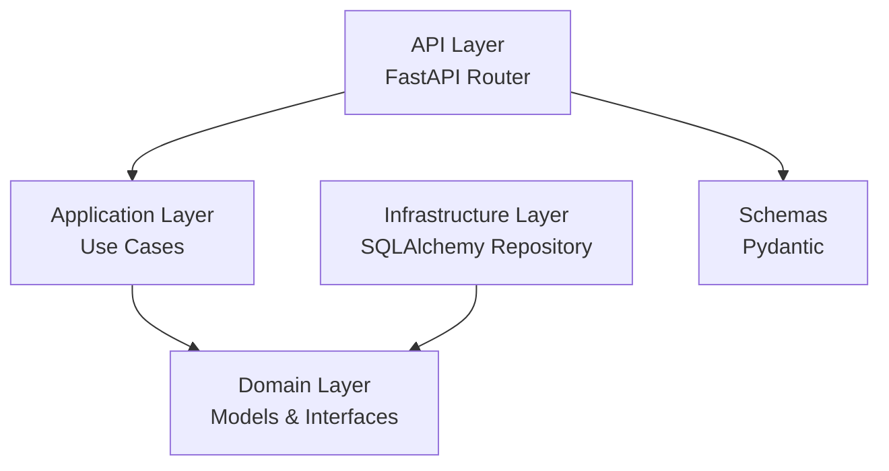
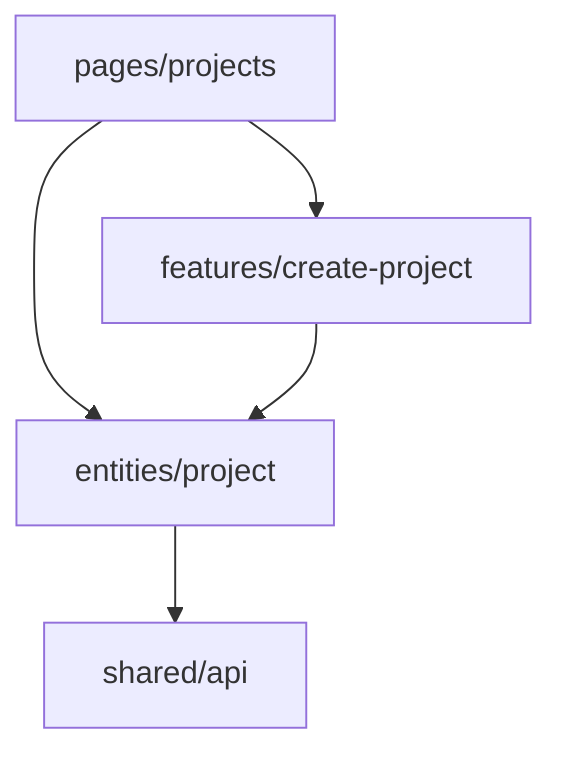
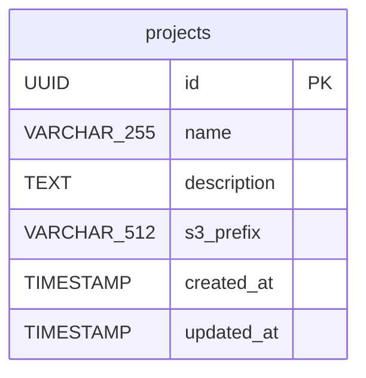

# 設計書: プロジェクト管理（Project CRUD）

## 概要

System Reforgeにおけるプロジェクト管理機能の設計。バックエンドはクリーンアーキテクチャ（FastAPI + SQLAlchemy + PostgreSQL）、フロントエンドはFSD（React + Mantine + React Query）で実装する。

プロジェクトはレガシーコード解析の基本単位であり、CRUD操作（作成・一覧・詳細・削除）を提供する。

## アーキテクチャ

### バックエンド（クリーンアーキテクチャ）



依存方向: `api → application → domain ← infrastructure`

- **API層**: FastAPIルーター。リクエスト/レスポンスのシリアライズ、バリデーション
- **Application層**: ユースケース。ビジネスロジックのオーケストレーション
- **Domain層**: エンティティ、リポジトリインターフェース。フレームワーク非依存
- **Infrastructure層**: SQLAlchemyによるリポジトリ実装、DB接続

### フロントエンド（FSD）



依存方向: `pages → features → entities → shared`

## コンポーネントとインターフェース

### バックエンド

#### 1. Domain層

**Project エンティティ** (`server/domain/models/project.py`)

```python
@dataclass
class Project:
    id: UUID
    name: str
    description: str | None
    s3_prefix: str
    created_at: datetime
    updated_at: datetime
```

**ProjectRepository インターフェース** (`server/domain/repositories/project_repository.py`)

```python
class ProjectRepository(ABC):
    async def create(self, project: Project) -> Project
    async def find_by_id(self, project_id: UUID) -> Project | None
    async def find_all(self, page: int, per_page: int) -> tuple[list[Project], int]
    async def delete(self, project_id: UUID) -> bool
```

#### 2. Application層

**CreateProjectUseCase** (`server/application/projects/create_project.py`)
- 入力: name, description(任意)
- 処理: UUID生成、s3_prefix生成（`projects/{uuid}`）、タイムスタンプ設定、リポジトリ経由で保存
- 出力: 作成されたProjectエンティティ

**ListProjectsUseCase** (`server/application/projects/list_projects.py`)
- 入力: page, per_page
- 処理: リポジトリ経由でページネーション付き一覧取得
- 出力: (プロジェクトリスト, 総件数)

**GetProjectUseCase** (`server/application/projects/get_project.py`)
- 入力: project_id
- 処理: リポジトリ経由で取得、存在しない場合は例外
- 出力: Projectエンティティ

**DeleteProjectUseCase** (`server/application/projects/delete_project.py`)
- 入力: project_id
- 処理: リポジトリ経由で削除、存在しない場合は例外
- 出力: なし

#### 3. Infrastructure層

**SQLAlchemy テーブルモデル** (`server/infrastructure/database/models.py`)

```python
class ProjectModel(Base):
    __tablename__ = "projects"
    id = Column(UUID, primary_key=True)
    name = Column(String(255), nullable=False)
    description = Column(Text, nullable=True)
    s3_prefix = Column(String(512), nullable=False)
    created_at = Column(DateTime, nullable=False, server_default=func.now())
    updated_at = Column(DateTime, nullable=False, server_default=func.now(), onupdate=func.now())
```

**SQLAlchemyProjectRepository** (`server/infrastructure/database/repositories/project_repository.py`)
- ProjectRepositoryインターフェースの実装
- asyncpg経由の非同期DB操作
- find_allはcreated_at降順でソート

**DB接続** (`server/infrastructure/database/connection.py`)
- AsyncSessionの生成
- SQLAlchemy async engine設定

#### 4. API層

**プロジェクトルーター** (`server/api/routes/projects.py`)

| エンドポイント | メソッド | 説明 |
|---------------|---------|------|
| `/api/v1/projects` | POST | プロジェクト作成 |
| `/api/v1/projects` | GET | プロジェクト一覧（ページネーション付き） |
| `/api/v1/projects/{project_id}` | GET | プロジェクト詳細 |
| `/api/v1/projects/{project_id}` | DELETE | プロジェクト削除 |

**Pydanticスキーマ** (`server/api/schemas/project.py`)

```python
class ProjectCreateRequest(BaseModel):
    name: str  # 1〜255文字、ホワイトスペースのみ不可
    description: str | None = None

class ProjectResponse(BaseModel):
    id: UUID
    name: str
    description: str | None
    s3_prefix: str
    created_at: datetime
    updated_at: datetime

class ProjectListResponse(BaseModel):
    data: list[ProjectResponse]
    pagination: PaginationResponse

class PaginationResponse(BaseModel):
    total: int
    page: int
    per_page: int
```

**依存性注入** (`server/api/dependencies.py`)
- get_session: AsyncSessionの提供
- get_project_repository: ProjectRepositoryの提供

### フロントエンド

#### 1. entities/project

**型定義** (`client/app/entities/project/model.ts`)

```typescript
interface Project {
  id: string;
  name: string;
  description: string | null;
  s3_prefix: string;
  created_at: string;
  updated_at: string;
}
```

**APIクライアント** (`client/app/entities/project/api.ts`)
- `createProject(data)`: POST /api/v1/projects
- `getProjects(params)`: GET /api/v1/projects
- `getProject(id)`: GET /api/v1/projects/{id}
- `deleteProject(id)`: DELETE /api/v1/projects/{id}

**React Queryフック** (`client/app/entities/project/hooks.ts`)
- `useProjects(page, perPage)`: 一覧取得
- `useProject(id)`: 詳細取得
- `useCreateProject()`: 作成ミューテーション
- `useDeleteProject()`: 削除ミューテーション

#### 2. features/create-project

**プロジェクト作成フォーム** (`client/app/features/create-project/ui.tsx`)
- Mantine TextInput + Textarea
- React Hook Form + Zodバリデーション
- 送信成功後に一覧ページへ遷移

#### 3. pages/projects

**プロジェクト一覧ページ** (`client/app/pages/projects/ui.tsx`)
- プロジェクト一覧テーブル（Mantine Table）
- 新規作成ボタン → モーダルでフォーム表示
- 削除ボタン → 確認ダイアログ後に削除
- ローディング・エラー・空状態の表示

## データモデル

### ER図



### Alembicマイグレーション

projectsテーブルの作成マイグレーションを生成する。

```sql
CREATE TABLE projects (
    id UUID PRIMARY KEY,
    name VARCHAR(255) NOT NULL,
    description TEXT,
    s3_prefix VARCHAR(512) NOT NULL,
    created_at TIMESTAMP NOT NULL DEFAULT NOW(),
    updated_at TIMESTAMP NOT NULL DEFAULT NOW()
);
```


## 正当性プロパティ

*プロパティとは、システムのすべての有効な実行において成り立つべき特性や振る舞いのことである。人間が読める仕様と機械的に検証可能な正当性保証の橋渡しとなる。*

### Property 1: 作成→取得ラウンドトリップ

*任意の*有効なプロジェクト名と説明に対して、プロジェクトを作成し、返却されたIDで取得した場合、取得結果のname、descriptionが作成時の入力と一致し、id（UUID形式）、s3_prefix、created_at、updated_atが設定されていること。

**Validates: Requirements 1.1, 1.4, 3.1**

### Property 2: 無効入力のバリデーション拒否

*任意の*ホワイトスペースのみの文字列、空文字列、または255文字超の文字列に対して、プロジェクト作成を試みた場合、バリデーションエラーが返却され、プロジェクトが作成されないこと。

**Validates: Requirements 1.2, 1.3**

### Property 3: ページネーションの正確性

*任意の*N個のプロジェクトが存在する状態で、page=PとperPage=Sで一覧取得した場合、返却件数がmin(S, max(0, N - (P-1)*S))と一致し、pagination.totalがNと一致すること。

**Validates: Requirements 2.1, 2.2**

### Property 4: 一覧の降順ソート

*任意の*複数のプロジェクトが存在する状態で一覧取得した場合、返却されたプロジェクトのcreated_atが降順であること。

**Validates: Requirements 2.4**

### Property 5: 存在しないIDへのNOT_FOUND

*任意の*ランダムなUUIDに対して、そのIDのプロジェクトが存在しない場合、詳細取得および削除の両方でエラーコード"NOT_FOUND"が返却されること。

**Validates: Requirements 3.2, 4.2**

### Property 6: 削除→取得でNOT_FOUND

*任意の*作成済みプロジェクトに対して、削除を実行した後に同じIDで取得を試みた場合、NOT_FOUNDが返却されること。

**Validates: Requirements 4.1**

### Property 7: レスポンス形式の統一性

*任意の*APIリクエストに対して、成功レスポンスは`data`キーを含み、エラーレスポンスは`error.code`と`error.message`を含み、一覧レスポンスは`data`配列と`pagination`オブジェクトを含むこと。

**Validates: Requirements 7.1, 7.2, 7.3**

### Property 8: フロントエンドバリデーション

*任意の*ホワイトスペースのみの文字列に対して、プロジェクト作成フォームのバリデーションが拒否し、送信が防止されること。

**Validates: Requirements 6.2**

## エラーハンドリング

### バックエンド

| エラー種別 | HTTPステータス | エラーコード | 対応 |
|-----------|--------------|------------|------|
| バリデーションエラー | 422 | VALIDATION_ERROR | Pydanticバリデーションエラーの詳細を返却 |
| プロジェクト未検出 | 404 | NOT_FOUND | "Project not found" メッセージを返却 |
| DB接続エラー | 500 | INTERNAL_ERROR | エラーログ出力、汎用エラーメッセージを返却 |

**例外クラス** (`server/domain/exceptions.py`)

```python
class ProjectNotFoundError(Exception):
    pass
```

**例外ハンドラ** (`server/api/error_handlers.py`)
- ProjectNotFoundError → 404レスポンス
- ValidationError → 422レスポンス
- 未処理例外 → 500レスポンス

### フロントエンド

- API通信エラー: React Queryのエラーハンドリングで表示
- バリデーションエラー: React Hook Form + Zodで即時フィードバック
- ネットワークエラー: リトライ機能（React Queryデフォルト）

## テスト戦略

### バックエンド

**プロパティベーステスト（pytest + Hypothesis）**
- 各正当性プロパティに対して1つのプロパティベーステストを実装
- 最低100イテレーション/テスト
- タグ形式: `Feature: project-management, Property N: {property_text}`
- ドメイン層・Application層のロジックを対象

**ユニットテスト（pytest）**
- ユースケースのエッジケース
- バリデーションの境界値テスト
- エラーハンドリングの確認
- リポジトリのモックを使用

**統合テスト（pytest + httpx）**
- APIエンドポイントのE2Eテスト
- テスト用PostgreSQLを使用

### フロントエンド

**プロパティベーステスト（Vitest + fast-check）**
- フォームバリデーションのプロパティテスト
- 最低100イテレーション/テスト

**ユニットテスト（Vitest + React Testing Library）**
- コンポーネントの表示テスト
- ユーザーインタラクションテスト
- APIモックを使用（MSW）

### テストライブラリ

| レイヤー | テストフレームワーク | PBTライブラリ |
|---------|-------------------|-------------|
| バックエンド | pytest | Hypothesis |
| フロントエンド | Vitest | fast-check |
