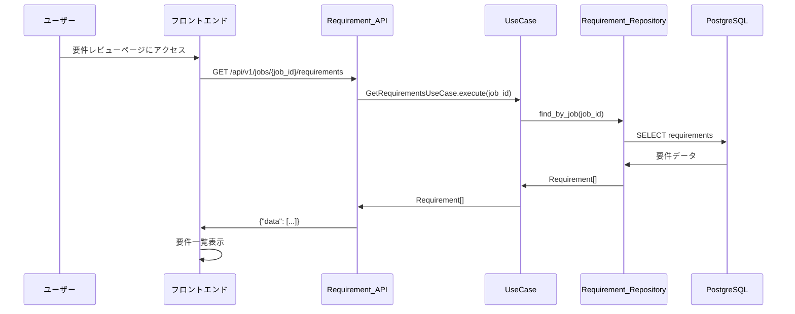
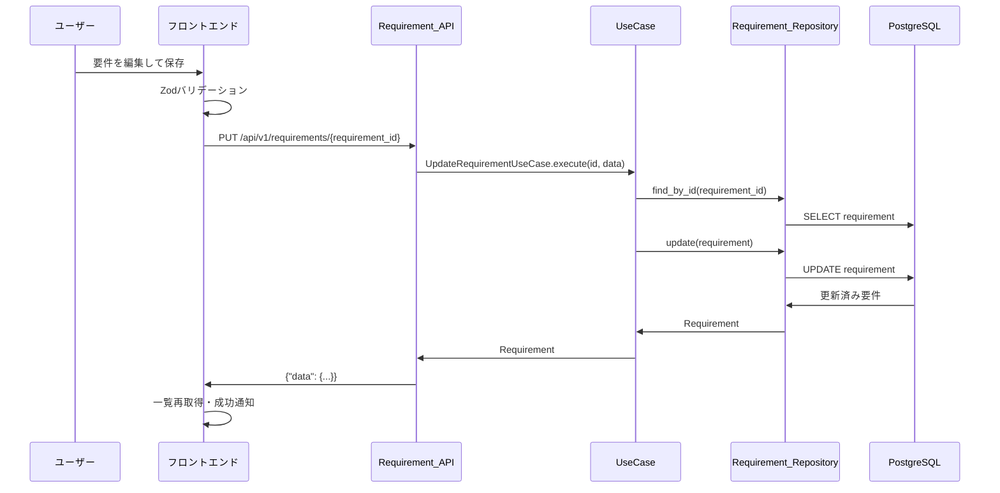
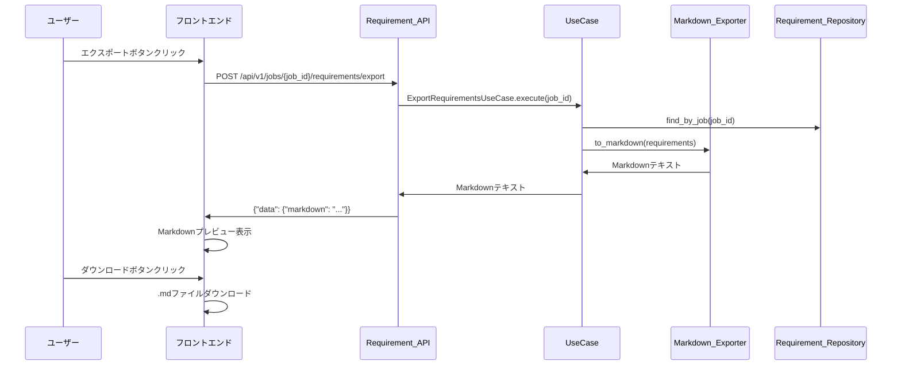
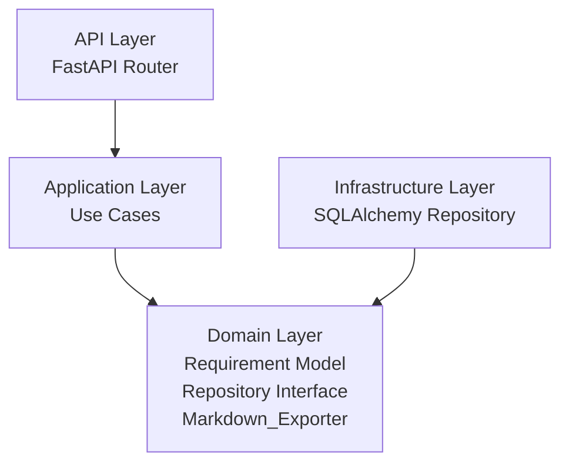
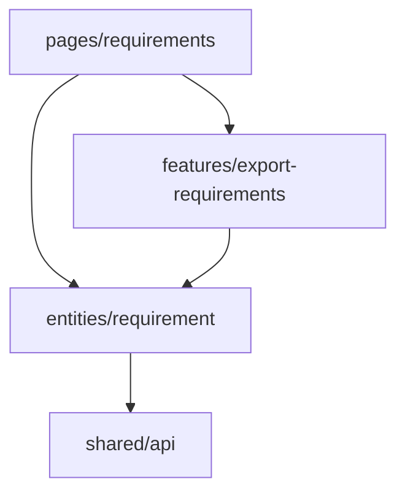
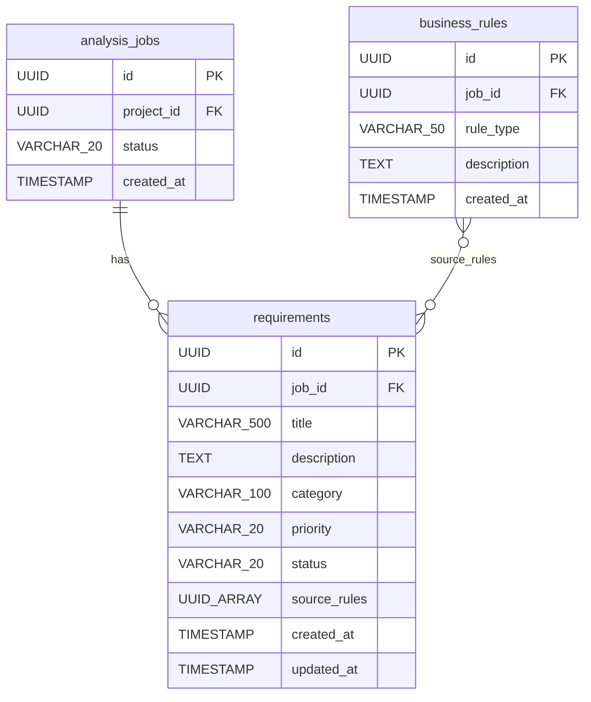

# 設計書: 要件レビュー・エクスポート

## 概要

System Reforgeにおける要件レビュー・エクスポート機能の設計。業務ルール抽出機能によって生成された要件定義データを一覧表示し、レビュー・編集・ステータス管理を行い、Markdown形式でエクスポートする。

バックエンドはクリーンアーキテクチャ（FastAPI + SQLAlchemy + PostgreSQL）で要件CRUD・エクスポートAPIを、フロントエンドはFSD（React + Mantine + React Hook Form + Zod + React Markdown）で要件レビューUI・編集フォーム・Markdownプレビューを実装する。

前提条件:
- project-management、zip-upload、analysis-job、dependency-visualization、business-rule-extraction仕様が実装済み
- analysis_jobs、business_rulesテーブルは既存
- 業務ルール抽出後にrequirementsテーブルにデータが生成されている前提

## アーキテクチャ

### 処理フロー







### バックエンド（クリーンアーキテクチャ）



依存方向: `api → application → domain ← infrastructure`

### フロントエンド（FSD）



依存方向: `pages → features → entities → shared`

## コンポーネントとインターフェース

### バックエンド

#### 1. Domain層

**RequirementStatus 列挙型** (`server/app/domain/models/requirement.py`)

```python
from enum import Enum

class RequirementStatus(str, Enum):
    DRAFT = "draft"
    REVIEWED = "reviewed"
    APPROVED = "approved"

class RequirementPriority(str, Enum):
    HIGH = "high"
    MEDIUM = "medium"
    LOW = "low"
```

**Requirement エンティティ** (`server/app/domain/models/requirement.py`)

```python
from dataclasses import dataclass, field
from datetime import datetime
from uuid import UUID

@dataclass
class Requirement:
    id: UUID
    job_id: UUID
    title: str
    description: str
    category: str | None
    priority: RequirementPriority | None
    status: RequirementStatus
    source_rules: list[UUID] | None
    created_at: datetime
    updated_at: datetime

    def __post_init__(self) -> None:
        if not self.title or not self.title.strip():
            raise ValueError("title must not be empty")
        if not self.description or not self.description.strip():
            raise ValueError("description must not be empty")
        if self.status and self.status not in RequirementStatus.__members__.values():
            raise ValueError(f"invalid status: {self.status}")
        if self.priority and self.priority not in RequirementPriority.__members__.values():
            raise ValueError(f"invalid priority: {self.priority}")
```

**RequirementRepository インターフェース** (`server/app/domain/repositories/requirement_repository.py`)

```python
from abc import ABC, abstractmethod
from uuid import UUID

class RequirementRepository(ABC):
    @abstractmethod
    async def find_by_job(self, job_id: UUID) -> list[Requirement]:
        """指定ジョブの要件をcreated_at昇順で取得する。"""

    @abstractmethod
    async def find_by_id(self, requirement_id: UUID) -> Requirement | None:
        """IDで要件を取得する。存在しない場合はNone。"""

    @abstractmethod
    async def update(self, requirement: Requirement) -> Requirement:
        """要件を更新する。"""
```

**MarkdownExporter ドメインサービス** (`server/app/domain/services/markdown_exporter.py`)

```python
class MarkdownExporter:
    def to_markdown(self, requirements: list[Requirement]) -> str:
        """
        要件リストをMarkdown形式の文字列に変換する。
        - 先頭に「# 要件定義書」ヘッダー
        - 各要件を「## {title}」見出しで出力
        - description、category、priority、statusをリスト形式で出力
        - 要件が0件の場合はヘッダーのみ
        """
        lines = ["# 要件定義書", ""]
        if not requirements:
            return "\n".join(lines)
        for req in requirements:
            lines.append(f"## {req.title}")
            lines.append("")
            lines.append(req.description)
            lines.append("")
            lines.append(f"- **カテゴリ**: {req.category or '未分類'}")
            lines.append(f"- **優先度**: {req.priority.value if req.priority else '未設定'}")
            lines.append(f"- **ステータス**: {req.status.value}")
            lines.append("")
        return "\n".join(lines)
```

#### 2. Application層

**GetRequirementsUseCase** (`server/app/application/requirements/get_requirements.py`)

```python
class GetRequirementsUseCase:
    def __init__(
        self,
        job_repository: AnalysisJobRepository,
        requirement_repository: RequirementRepository,
    ): ...

    async def execute(self, job_id: UUID) -> list[Requirement]:
        """
        1. ジョブ存在確認（なければAnalysisJobNotFoundError）
        2. 要件一覧取得（created_at昇順）
        3. 返却
        """
```

**UpdateRequirementUseCase** (`server/app/application/requirements/update_requirement.py`)

```python
@dataclass
class UpdateRequirementInput:
    title: str
    description: str
    category: str | None
    priority: str | None
    status: str

class UpdateRequirementUseCase:
    def __init__(
        self,
        requirement_repository: RequirementRepository,
    ): ...

    async def execute(self, requirement_id: UUID, input: UpdateRequirementInput) -> Requirement:
        """
        1. 要件存在確認（なければRequirementNotFoundError）
        2. 入力値でフィールド更新
        3. updated_atを現在時刻に設定
        4. バリデーション（ドメインモデルの__post_init__で実行）
        5. リポジトリで保存
        6. 更新済み要件を返却
        """
```

**ExportRequirementsUseCase** (`server/app/application/requirements/export_requirements.py`)

```python
class ExportRequirementsUseCase:
    def __init__(
        self,
        job_repository: AnalysisJobRepository,
        requirement_repository: RequirementRepository,
        markdown_exporter: MarkdownExporter,
    ): ...

    async def execute(self, job_id: UUID) -> str:
        """
        1. ジョブ存在確認（なければAnalysisJobNotFoundError）
        2. 要件一覧取得
        3. MarkdownExporterでMarkdown生成
        4. Markdown文字列を返却
        """
```

#### 3. Infrastructure層

**SQLAlchemy テーブルモデル** (`server/app/infrastructure/database/models.py` に追加)

```python
class RequirementModel(Base):
    __tablename__ = "requirements"
    id = Column(UUID, primary_key=True)
    job_id = Column(UUID, ForeignKey("analysis_jobs.id"), nullable=False, index=True)
    title = Column(String(500), nullable=False)
    description = Column(Text, nullable=False)
    category = Column(String(100), nullable=True)
    priority = Column(String(20), nullable=True)
    status = Column(String(20), nullable=False, server_default="draft", index=True)
    source_rules = Column(ARRAY(UUID), nullable=True)
    created_at = Column(DateTime, nullable=False, server_default=func.now())
    updated_at = Column(DateTime, nullable=False, server_default=func.now(), onupdate=func.now())
```

**SQLAlchemyRequirementRepository** (`server/app/infrastructure/database/repositories/requirement_repository.py`)

- RequirementRepositoryインターフェースの実装
- find_by_jobはcreated_at昇順でソート
- RequirementModel ↔ Requirement のマッピング
- updateはupdated_atを現在時刻に設定

#### 4. API層

**要件ルーター** (`server/app/api/routes/requirements.py`)

| エンドポイント | メソッド | 説明 |
|---------------|---------|------|
| `/api/v1/jobs/{job_id}/requirements` | GET | 要件一覧取得 |
| `/api/v1/requirements/{requirement_id}` | PUT | 要件編集 |
| `/api/v1/jobs/{job_id}/requirements/export` | POST | 要件エクスポート |

**Pydanticスキーマ** (`server/app/api/schemas/requirement.py`)

```python
class RequirementResponse(BaseModel):
    id: str
    job_id: str
    title: str
    description: str
    category: str | None
    priority: str | None
    status: str
    source_rules: list[str] | None
    created_at: datetime
    updated_at: datetime

class RequirementListResponse(BaseModel):
    data: list[RequirementResponse]

class RequirementUpdateRequest(BaseModel):
    title: str
    description: str
    category: str | None = None
    priority: str | None = None
    status: str

    @field_validator("title")
    @classmethod
    def title_not_empty(cls, v: str) -> str:
        if not v.strip():
            raise ValueError("title must not be empty")
        return v

    @field_validator("description")
    @classmethod
    def description_not_empty(cls, v: str) -> str:
        if not v.strip():
            raise ValueError("description must not be empty")
        return v

    @field_validator("priority")
    @classmethod
    def validate_priority(cls, v: str | None) -> str | None:
        if v is not None and v not in ("high", "medium", "low"):
            raise ValueError("priority must be high, medium, or low")
        return v

    @field_validator("status")
    @classmethod
    def validate_status(cls, v: str) -> str:
        if v not in ("draft", "reviewed", "approved"):
            raise ValueError("status must be draft, reviewed, or approved")
        return v

class RequirementDetailResponse(BaseModel):
    data: RequirementResponse

class ExportResponse(BaseModel):
    data: ExportData

class ExportData(BaseModel):
    markdown: str
```

### フロントエンド

#### 1. entities/requirement

**型定義** (`client/app/entities/requirement/model.ts`)

```typescript
type RequirementStatus = "draft" | "reviewed" | "approved";
type RequirementPriority = "high" | "medium" | "low";

interface Requirement {
  id: string;
  job_id: string;
  title: string;
  description: string;
  category: string | null;
  priority: RequirementPriority | null;
  status: RequirementStatus;
  source_rules: string[] | null;
  created_at: string;
  updated_at: string;
}

interface RequirementUpdateInput {
  title: string;
  description: string;
  category: string | null;
  priority: RequirementPriority | null;
  status: RequirementStatus;
}
```

**Zodスキーマ** (`client/app/entities/requirement/schema.ts`)

```typescript
import { z } from "zod";

const requirementFormSchema = z.object({
  title: z.string().min(1, "タイトルは必須です").refine(
    (v) => v.trim().length > 0,
    "タイトルは空白のみにできません"
  ),
  description: z.string().min(1, "説明は必須です").refine(
    (v) => v.trim().length > 0,
    "説明は空白のみにできません"
  ),
  category: z.string().nullable(),
  priority: z.enum(["high", "medium", "low"]).nullable(),
  status: z.enum(["draft", "reviewed", "approved"]),
});

type RequirementFormValues = z.infer<typeof requirementFormSchema>;
```

**APIクライアント** (`client/app/entities/requirement/api.ts`)

```typescript
const requirementApi = {
  listByJob: (jobId: string) =>
    apiClient.get<{ data: Requirement[] }>(
      `/api/v1/jobs/${jobId}/requirements`
    ),

  update: (requirementId: string, data: RequirementUpdateInput) =>
    apiClient.put<{ data: Requirement }>(
      `/api/v1/requirements/${requirementId}`,
      data
    ),

  export: (jobId: string) =>
    apiClient.post<{ data: { markdown: string } }>(
      `/api/v1/jobs/${jobId}/requirements/export`
    ),
};
```

**React Queryフック** (`client/app/entities/requirement/hooks.ts`)

```typescript
function useRequirements(jobId: string) {
  return useQuery({
    queryKey: ["requirements", jobId],
    queryFn: () => requirementApi.listByJob(jobId),
  });
}

function useUpdateRequirement() {
  const queryClient = useQueryClient();
  return useMutation({
    mutationFn: ({ id, data }: { id: string; data: RequirementUpdateInput }) =>
      requirementApi.update(id, data),
    onSuccess: () => {
      queryClient.invalidateQueries({ queryKey: ["requirements"] });
    },
  });
}

function useExportRequirements() {
  return useMutation({
    mutationFn: (jobId: string) => requirementApi.export(jobId),
  });
}
```

#### 2. pages/requirements

**要件レビューページ** (`client/app/pages/requirements/ui.tsx`)

```typescript
function RequirementsPage() {
  const { jobId } = useParams();
  const { data, isLoading, error } = useRequirements(jobId);
  const [editingId, setEditingId] = useState<string | null>(null);
  const [exportMarkdown, setExportMarkdown] = useState<string | null>(null);

  if (isLoading) return <LoadingOverlay visible />;
  if (error) return <Alert color="red">エラーが発生しました</Alert>;

  const requirements = data?.data ?? [];

  return (
    <Stack>
      <Group justify="space-between">
        <Title order={2}>要件レビュー</Title>
        <ExportButton jobId={jobId} onExport={setExportMarkdown} />
      </Group>

      {requirements.length === 0 ? (
        <EmptyState message="要件がありません" />
      ) : (
        <RequirementList
          requirements={requirements}
          onEdit={setEditingId}
        />
      )}

      {editingId && (
        <RequirementEditModal
          requirementId={editingId}
          requirement={requirements.find(r => r.id === editingId)}
          onClose={() => setEditingId(null)}
        />
      )}

      {exportMarkdown && (
        <MarkdownPreviewModal
          markdown={exportMarkdown}
          onClose={() => setExportMarkdown(null)}
        />
      )}
    </Stack>
  );
}
```

**要件一覧コンポーネント** (`client/app/pages/requirements/ui/RequirementList.tsx`)

各要件をカード形式で表示。title、category、priority、statusをバッジ付きで表示。

```typescript
const STATUS_COLORS: Record<RequirementStatus, string> = {
  draft: "gray",
  reviewed: "blue",
  approved: "green",
};

const PRIORITY_COLORS: Record<RequirementPriority, string> = {
  high: "red",
  medium: "yellow",
  low: "blue",
};
```

#### 3. 要件編集フォーム

**RequirementEditModal** (`client/app/pages/requirements/ui/RequirementEditModal.tsx`)

```typescript
function RequirementEditModal({ requirementId, requirement, onClose }) {
  const form = useForm<RequirementFormValues>({
    resolver: zodResolver(requirementFormSchema),
    defaultValues: {
      title: requirement.title,
      description: requirement.description,
      category: requirement.category,
      priority: requirement.priority,
      status: requirement.status,
    },
  });

  const updateMutation = useUpdateRequirement();

  const onSubmit = (values: RequirementFormValues) => {
    updateMutation.mutate(
      { id: requirementId, data: values },
      {
        onSuccess: () => {
          notifications.show({ message: "要件を更新しました", color: "green" });
          onClose();
        },
        onError: () => {
          notifications.show({ message: "更新に失敗しました", color: "red" });
        },
      }
    );
  };

  return (
    <Modal opened onClose={onClose} title="要件編集" size="lg">
      <form onSubmit={form.handleSubmit(onSubmit)}>
        <Stack>
          <TextInput label="タイトル" {...form.register("title")} error={form.formState.errors.title?.message} />
          <Textarea label="説明" rows={6} {...form.register("description")} error={form.formState.errors.description?.message} />
          <TextInput label="カテゴリ" {...form.register("category")} />
          <Select label="優先度" data={[
            { value: "high", label: "高" },
            { value: "medium", label: "中" },
            { value: "low", label: "低" },
          ]} {...form.register("priority")} />
          <Select label="ステータス" data={[
            { value: "draft", label: "ドラフト" },
            { value: "reviewed", label: "レビュー済み" },
            { value: "approved", label: "承認済み" },
          ]} {...form.register("status")} />
          <Group justify="flex-end">
            <Button variant="outline" onClick={onClose}>キャンセル</Button>
            <Button type="submit" loading={updateMutation.isPending}>保存</Button>
          </Group>
        </Stack>
      </form>
    </Modal>
  );
}
```

#### 4. features/export-requirements

**エクスポートボタン** (`client/app/features/export-requirements/ui.tsx`)

```typescript
function ExportButton({ jobId, onExport }) {
  const exportMutation = useExportRequirements();

  const handleExport = () => {
    exportMutation.mutate(jobId, {
      onSuccess: (res) => onExport(res.data.markdown),
      onError: () => notifications.show({ message: "エクスポートに失敗しました", color: "red" }),
    });
  };

  return (
    <Button onClick={handleExport} loading={exportMutation.isPending} leftSection={<IconDownload />}>
      エクスポート
    </Button>
  );
}
```

**Markdownプレビューモーダル** (`client/app/features/export-requirements/ui/MarkdownPreviewModal.tsx`)

```typescript
import ReactMarkdown from "react-markdown";

function MarkdownPreviewModal({ markdown, onClose }) {
  const handleDownload = () => {
    const blob = new Blob([markdown], { type: "text/markdown" });
    const url = URL.createObjectURL(blob);
    const a = document.createElement("a");
    a.href = url;
    a.download = "requirements.md";
    a.click();
    URL.revokeObjectURL(url);
  };

  return (
    <Modal opened onClose={onClose} title="Markdownプレビュー" size="xl">
      <Stack>
        <ScrollArea h={400}>
          <ReactMarkdown>{markdown}</ReactMarkdown>
        </ScrollArea>
        <Group justify="flex-end">
          <Button variant="outline" onClick={onClose}>閉じる</Button>
          <Button onClick={handleDownload} leftSection={<IconDownload />}>ダウンロード</Button>
        </Group>
      </Stack>
    </Modal>
  );
}
```

## データモデル

### ER図



### Alembicマイグレーション

requirementsテーブルの作成マイグレーション:

```sql
CREATE TABLE requirements (
    id UUID PRIMARY KEY,
    job_id UUID NOT NULL REFERENCES analysis_jobs(id),
    title VARCHAR(500) NOT NULL,
    description TEXT NOT NULL,
    category VARCHAR(100),
    priority VARCHAR(20),
    status VARCHAR(20) NOT NULL DEFAULT 'draft',
    source_rules UUID[],
    created_at TIMESTAMP NOT NULL DEFAULT NOW(),
    updated_at TIMESTAMP NOT NULL DEFAULT NOW()
);

CREATE INDEX idx_requirements_job_id ON requirements(job_id);
CREATE INDEX idx_requirements_status ON requirements(status);
```


## 正当性プロパティ

*プロパティとは、システムのすべての有効な実行において成り立つべき特性や振る舞いのことである。人間が読める仕様と機械的に検証可能な正当性保証の橋渡しとなる。*

### Property 1: 要件一覧の昇順ソート

*任意の*N個の要件が存在するジョブに対して、要件一覧を取得した場合、返却された要件のcreated_atが昇順であること。

**Validates: Requirements 1.1**

### Property 2: 存在しないリソースへのNOT_FOUND

*任意の*ランダムなUUIDに対して、そのIDに対応するジョブまたは要件が存在しない場合、APIはHTTPステータス404とエラーコード"NOT_FOUND"を返却すること。

**Validates: Requirements 1.2, 2.2, 3.3**

### Property 3: 要件更新ラウンドトリップ

*任意の*有効な要件と*任意の*有効な更新入力に対して、更新APIを呼び出した後に取得した要件は、更新入力のtitle、description、category、priority、statusと一致し、updated_atが更新前より新しいこと。

**Validates: Requirements 2.1**

### Property 4: ドメインモデルの空フィールドバリデーション

*任意の*ホワイトスペースのみの文字列に対して、titleまたはdescriptionとしてRequirementを生成した場合、ValueErrorが発生すること。また、*任意の*非空文字列に対して、titleおよびdescriptionとして使用した場合、バリデーションエラーが発生しないこと。

**Validates: Requirements 4.4, 4.5**

### Property 5: ドメインモデルの列挙値バリデーション

*任意の*文字列に対して、Requirementのstatusとして受け入れられるのは"draft"、"reviewed"、"approved"のいずれかの場合のみであること。また、priorityとして受け入れられるのは"high"、"medium"、"low"、Noneのいずれかの場合のみであること。

**Validates: Requirements 4.2, 4.3**

### Property 6: Markdownエクスポートの完全性

*任意の*要件リストに対して、Markdown_Exporterで生成したMarkdownは先頭に「# 要件定義書」ヘッダーを含み、各要件のtitle、description、category、priority、statusがすべて含まれること。各要件は「##」見出しで区切られること。

**Validates: Requirements 5.1, 5.2, 5.3, 3.2**

### Property 7: Markdownエクスポートのセクション数ラウンドトリップ

*任意の*N個の有効なRequirementリストに対して、Markdown_Exporterで生成したMarkdown内の「##」見出しの数がNと一致すること。

**Validates: Requirements 5.4**

### Property 8: バッジ色マッピングの正確性

*任意の*有効なRequirementStatusに対して、statusバッジの色はdraft→gray、reviewed→blue、approved→greenであること。*任意の*有効なRequirementPriorityに対して、priorityバッジの色はhigh→red、medium→yellow、low→blueであること。

**Validates: Requirements 6.3, 6.4**

### Property 9: APIレスポンス形式の統一性

*任意の*Requirement_APIリクエストに対して、成功レスポンスは`data`キーを含み、エラーレスポンスは`error.code`と`error.message`を含むこと。

**Validates: Requirements 9.1, 9.2**

## エラーハンドリング

### バックエンド

| エラー種別 | HTTPステータス | エラーコード | 対応 |
|-----------|--------------|------------|------|
| ジョブ未検出 | 404 | NOT_FOUND | "Analysis job not found" メッセージを返却 |
| 要件未検出 | 404 | NOT_FOUND | "Requirement not found" メッセージを返却 |
| バリデーションエラー（空title/description） | 422 | VALIDATION_ERROR | フィールド別エラーメッセージを返却 |
| バリデーションエラー（無効なstatus/priority） | 422 | VALIDATION_ERROR | 有効な値のリストを含むエラーメッセージを返却 |
| DB接続エラー | 500 | INTERNAL_ERROR | エラーログ出力、汎用エラーメッセージを返却 |

既存の例外クラスを再利用:
- `AnalysisJobNotFoundError` → 404レスポンス（analysis-job仕様で定義済み）

新規例外クラス:
- `RequirementNotFoundError` → 404レスポンス

### フロントエンド

- API通信エラー: React Queryのエラーハンドリングで表示（Mantine Notification）
- ネットワークエラー: React Queryのリトライ機能（デフォルト3回）
- フォームバリデーションエラー: Zodスキーマによるクライアントサイドバリデーション、フィールド下にエラーメッセージ表示
- 空データ: 要件0件時に空状態メッセージを表示

## テスト戦略

### バックエンド

**プロパティベーステスト（pytest + Hypothesis）**
- 各正当性プロパティに対して1つのプロパティベーステストを実装
- 最低100イテレーション/テスト
- タグ形式: `Feature: requirements-review, Property N: {property_text}`
- ドメイン層（Requirementバリデーション、MarkdownExporter）とApplication層（ユースケース）を重点的にテスト

**ユニットテスト（pytest）**
- ユースケースのエッジケース（空データ、存在しないID）
- MarkdownExporterの空リスト処理
- リポジトリのモックを使用

**統合テスト（pytest + httpx）**
- APIエンドポイントのE2Eテスト
- テスト用PostgreSQLを使用

### フロントエンド

**プロパティベーステスト（Vitest + fast-check）**
- バッジ色マッピングのプロパティテスト
- Zodスキーマバリデーションのプロパティテスト
- 最低100イテレーション/テスト

**ユニットテスト（Vitest + React Testing Library）**
- コンポーネントの表示テスト（一覧、空状態、ローディング、エラー）
- 編集フォームのインタラクションテスト
- Markdownプレビューの表示テスト
- APIモックを使用（MSW）

### テストライブラリ

| レイヤー | テストフレームワーク | PBTライブラリ |
|---------|-------------------|-------------|
| バックエンド | pytest | Hypothesis |
| フロントエンド | Vitest | fast-check |
