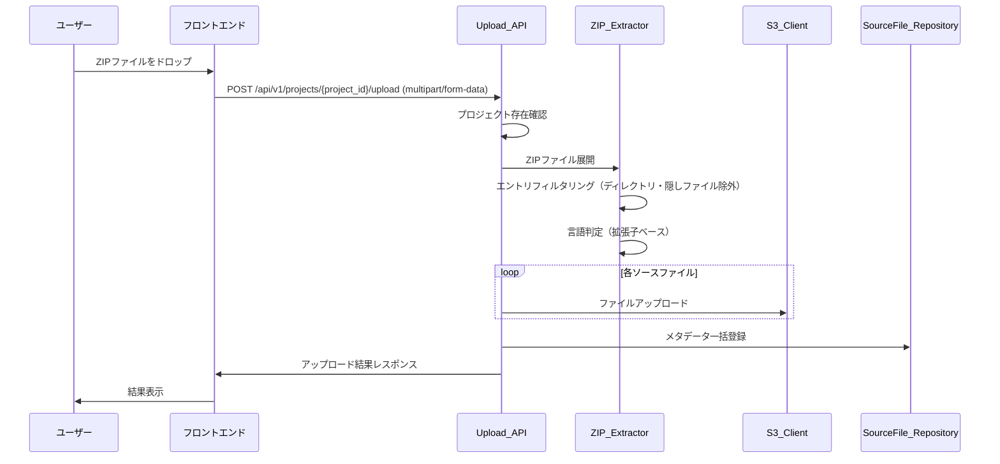
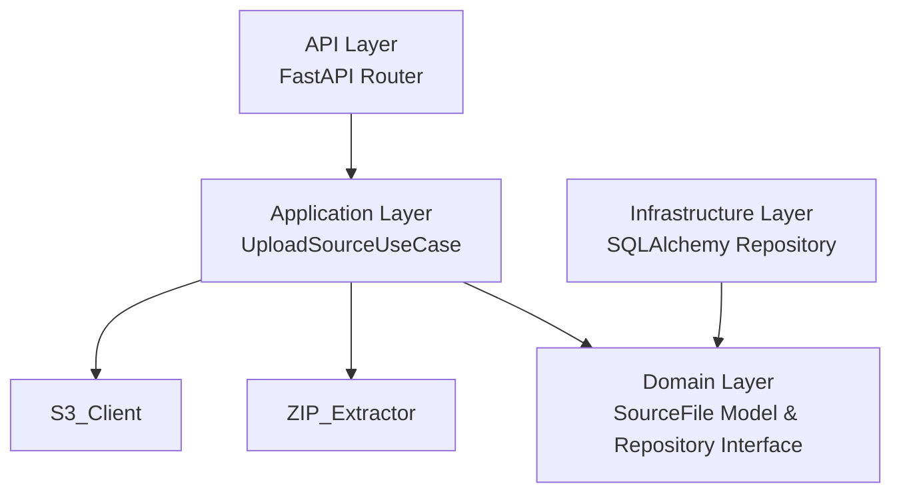
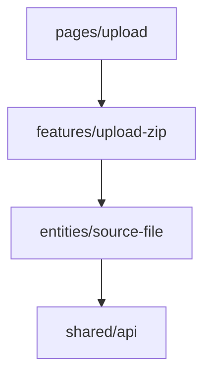
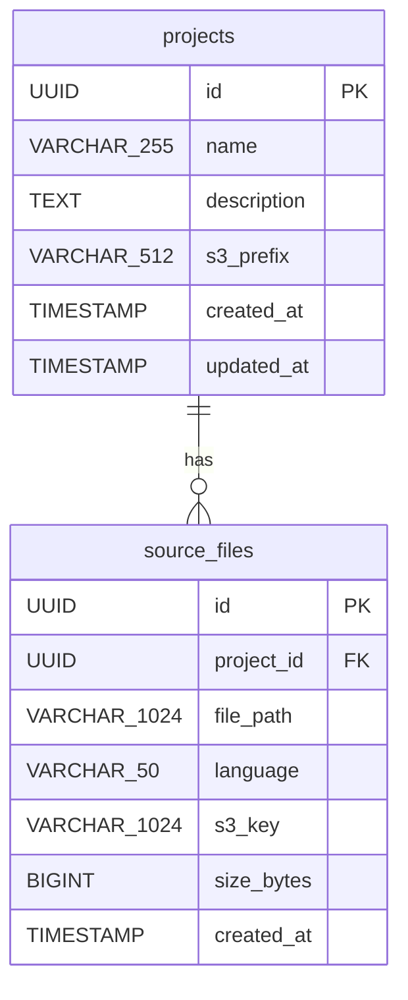

# 設計書: ZIPアップロード

## 概要

System ReforgeにおけるZIPアップロード機能の設計。レガシーコード（COBOLなど）をZIPファイルでアップロードし、S3に原本保存し、ソースファイルのメタデータをDBに登録する。バックエンドはクリーンアーキテクチャ（FastAPI + SQLAlchemy + boto3 + PostgreSQL）、フロントエンドはFSD（React + Mantine + React Dropzone + React Query）で実装する。

project-management仕様が先に実装されている前提で、projectsテーブル・Project関連コンポーネントは既存とする。

## アーキテクチャ

### 処理フロー



### バックエンド（クリーンアーキテクチャ）



依存方向: `api → application → domain ← infrastructure`

### フロントエンド（FSD）



## コンポーネントとインターフェース

### バックエンド

#### 1. Domain層

**SourceFile エンティティ** (`server/app/domain/models/source_file.py`)

```python
@dataclass
class SourceFile:
    id: UUID
    project_id: UUID
    file_path: str
    language: str
    s3_key: str
    size_bytes: int
    created_at: datetime
```

**SourceFileRepository インターフェース** (`server/app/domain/repositories/source_file_repository.py`)

```python
class SourceFileRepository(ABC):
    async def create_many(self, source_files: list[SourceFile]) -> list[SourceFile]
    async def find_by_project(self, project_id: UUID) -> list[SourceFile]
    async def find_by_id(self, source_file_id: UUID) -> SourceFile | None
```

#### 2. Application層

**ZIP_Extractor** (`server/app/application/sources/zip_extractor.py`)

ZIPファイルの展開・フィルタリング・言語判定を担当するピュアロジックモジュール。

```python
@dataclass
class ExtractedFile:
    file_path: str
    language: str
    content: bytes
    size_bytes: int

LANGUAGE_MAP: dict[str, str] = {
    ".cbl": "COBOL", ".cob": "COBOL", ".cpy": "COBOL",
    ".jcl": "JCL",
    ".py": "Python",
    ".java": "Java",
    ".js": "JavaScript", ".ts": "TypeScript",
    ".c": "C", ".h": "C",
    ".cpp": "C++", ".hpp": "C++",
    ".rb": "Ruby",
    ".pl": "Perl",
    ".sh": "Shell",
}

def detect_language(file_path: str) -> str:
    """拡張子から言語を判定。未知の場合は'unknown'を返す。"""

def is_excluded_entry(file_path: str) -> bool:
    """隠しファイル・システムファイル・ディレクトリエントリを判定。"""

def extract_zip(zip_data: bytes) -> list[ExtractedFile]:
    """ZIPバイナリを展開し、フィルタリング済みファイルリストを返す。"""
```

**UploadSourceUseCase** (`server/app/application/sources/upload_source.py`)

```python
class UploadSourceUseCase:
    def __init__(
        self,
        project_repository: ProjectRepository,
        source_file_repository: SourceFileRepository,
        s3_client: S3Client,
    ): ...

    async def execute(self, project_id: UUID, zip_data: bytes) -> UploadResult:
        """
        1. プロジェクト存在確認
        2. ZIP展開（extract_zip）
        3. 各ファイルをS3にアップロード
        4. メタデータをDB一括登録
        5. UploadResultを返却
        """

@dataclass
class UploadResult:
    project_id: UUID
    uploaded_files: list[UploadedFileInfo]
    total_files: int
    total_size_bytes: int

@dataclass
class UploadedFileInfo:
    file_path: str
    language: str
    s3_key: str
    size_bytes: int
```

#### 3. Infrastructure層

**SQLAlchemy テーブルモデル** (`server/app/infrastructure/database/models.py` に追加)

```python
class SourceFileModel(Base):
    __tablename__ = "source_files"
    id = Column(UUID, primary_key=True)
    project_id = Column(UUID, ForeignKey("projects.id"), nullable=False)
    file_path = Column(String(1024), nullable=False)
    language = Column(String(50), nullable=False)
    s3_key = Column(String(1024), nullable=False)
    size_bytes = Column(BigInteger, nullable=True)
    created_at = Column(DateTime, nullable=False, server_default=func.now())
```

**SQLAlchemySourceFileRepository** (`server/app/infrastructure/database/repositories/source_file_repository.py`)
- SourceFileRepositoryインターフェースの実装
- create_manyはbulk insertで実装

**S3Client** (`server/app/infrastructure/storage/s3_client.py`)

```python
class S3Client:
    def __init__(self, bucket_name: str, boto3_client=None): ...

    async def upload_file(self, key: str, data: bytes) -> None:
        """S3にファイルをアップロード。"""

    def generate_s3_key(self, s3_prefix: str, file_path: str) -> str:
        """S3キーを生成: {s3_prefix}/sources/{file_path}"""
```

#### 4. API層

**アップロードルーター** (`server/app/api/routes/upload.py`)

| エンドポイント | メソッド | 説明 |
|---------------|---------|------|
| `/api/v1/projects/{project_id}/upload` | POST | ZIPファイルアップロード（multipart/form-data） |

**Pydanticスキーマ** (`server/app/api/schemas/upload.py`)

```python
class UploadedFileResponse(BaseModel):
    file_path: str
    language: str
    s3_key: str
    size_bytes: int

class UploadResultResponse(BaseModel):
    project_id: UUID
    uploaded_files: list[UploadedFileResponse]
    total_files: int
    total_size_bytes: int
```

### フロントエンド

#### 1. entities/source-file

**型定義** (`client/app/entities/source-file/model.ts`)

```typescript
interface SourceFile {
  id: string;
  project_id: string;
  file_path: string;
  language: string;
  s3_key: string;
  size_bytes: number;
  created_at: string;
}

interface UploadResult {
  project_id: string;
  uploaded_files: UploadedFile[];
  total_files: number;
  total_size_bytes: number;
}

interface UploadedFile {
  file_path: string;
  language: string;
  s3_key: string;
  size_bytes: number;
}
```

#### 2. features/upload-zip

**アップロード機能** (`client/app/features/upload-zip/`)

- `api.ts`: `uploadZip(projectId, file)` — POST multipart/form-data
- `hooks.ts`: `useUploadZip()` — React Queryミューテーション（onUploadProgress対応）
- `ui.tsx`: React Dropzoneベースのアップロードコンポーネント
  - accept: `application/zip, application/x-zip-compressed`
  - ファイル選択後にファイル名・サイズ表示
  - アップロードボタン、プログレスバー
  - 成功時に結果表示、エラー時にエラーメッセージ表示

#### 3. pages/upload

**アップロードページ** (`client/app/pages/upload/ui.tsx`)

- プロジェクト選択（またはURLパラメータからproject_id取得）
- Upload_Dropzoneコンポーネントの配置
- アップロード結果の表示エリア

## データモデル

### ER図



### Alembicマイグレーション

source_filesテーブルの作成マイグレーション:

```sql
CREATE TABLE source_files (
    id UUID PRIMARY KEY,
    project_id UUID NOT NULL REFERENCES projects(id),
    file_path VARCHAR(1024) NOT NULL,
    language VARCHAR(50) NOT NULL,
    s3_key VARCHAR(1024) NOT NULL,
    size_bytes BIGINT,
    created_at TIMESTAMP NOT NULL DEFAULT NOW()
);

CREATE INDEX idx_source_files_project_id ON source_files(project_id);
```


## 正当性プロパティ

*プロパティとは、システムのすべての有効な実行において成り立つべき特性や振る舞いのことである。人間が読める仕様と機械的に検証可能な正当性保証の橋渡しとなる。*

### Property 1: アップロードラウンドトリップ

*任意の*有効なZIPファイル（1つ以上のソースファイルを含む）に対して、アップロードを実行した後、DBからproject_idでソースファイルを取得した場合、取得結果のファイル数がZIP内のフィルタリング済みファイル数と一致し、各ファイルのfile_path、language、s3_key、size_bytesが正しく設定されていること。

**Validates: Requirements 1.1, 2.3, 3.1**

### Property 2: S3キー生成フォーマット

*任意の*s3_prefixとfile_pathに対して、生成されるS3キーが `{s3_prefix}/sources/{file_path}` のフォーマットに一致すること。

**Validates: Requirements 2.1**

### Property 3: 拡張子→言語マッピング

*任意の*ファイルパスに対して、拡張子がLANGUAGE_MAPに存在する場合は対応する言語名が返り、存在しない場合は"unknown"が返ること。

**Validates: Requirements 3.2, 3.3**

### Property 4: ZIPエントリフィルタリング

*任意の*ZIPエントリリスト（ファイル、ディレクトリ、隠しファイル、システムファイルの混合）に対して、フィルタリング後のリストにはディレクトリエントリ、隠しファイル（.で始まるファイル名）、システムファイル（__MACOSX等）が含まれないこと。かつ、通常のファイルエントリはすべて保持されること。

**Validates: Requirements 4.1, 4.2, 4.4**

### Property 5: 存在しないプロジェクトへのNOT_FOUND

*任意の*ランダムなUUIDに対して、そのIDのプロジェクトが存在しない場合、アップロードAPIがエラーコード"NOT_FOUND"を返却すること。

**Validates: Requirements 1.3**

### Property 6: レスポンス形式の統一性

*任意の*アップロード結果に対して、成功レスポンスは`data`キーを含み`project_id`、`uploaded_files`、`total_files`、`total_size_bytes`を持つこと。uploaded_filesの各要素は`file_path`、`language`、`s3_key`、`size_bytes`を含むこと。エラーレスポンスは`error.code`と`error.message`を含むこと。

**Validates: Requirements 5.1, 5.2, 5.3**

### Property 7: フロントエンドファイルバリデーション

*任意の*非ZIPファイル（MIMEタイプがapplication/zipまたはapplication/x-zip-compressed以外）に対して、Upload_Dropzoneがファイルを拒否すること。

**Validates: Requirements 6.3**

## エラーハンドリング

### バックエンド

| エラー種別 | HTTPステータス | エラーコード | 対応 |
|-----------|--------------|------------|------|
| プロジェクト未検出 | 404 | NOT_FOUND | "Project not found" メッセージを返却 |
| 不正なファイル形式 | 422 | VALIDATION_ERROR | "Only ZIP files are accepted" メッセージを返却 |
| 空のZIPファイル | 422 | VALIDATION_ERROR | "ZIP file contains no source files" メッセージを返却 |
| 破損ZIPファイル | 422 | VALIDATION_ERROR | "Invalid or corrupted ZIP file" メッセージを返却 |
| S3アップロード失敗 | 500 | INTERNAL_ERROR | エラーログ出力、汎用エラーメッセージを返却 |
| DB登録失敗 | 500 | INTERNAL_ERROR | エラーログ出力、汎用エラーメッセージを返却 |

**例外クラス**（既存の `server/app/domain/exceptions.py` に追加）

```python
class InvalidZipFileError(Exception):
    pass

class EmptyZipFileError(Exception):
    pass
```

**例外ハンドラ**（既存の `server/app/api/error_handlers.py` に追加）
- InvalidZipFileError → 422レスポンス
- EmptyZipFileError → 422レスポンス

### フロントエンド

- ファイル形式エラー: React Dropzoneのaccept設定 + onDropRejectedで即時フィードバック
- API通信エラー: React Queryのエラーハンドリングで表示
- ネットワークエラー: リトライ機能（React Queryデフォルト）

## テスト戦略

### バックエンド

**プロパティベーステスト（pytest + Hypothesis）**
- 各正当性プロパティに対して1つのプロパティベーステストを実装
- 最低100イテレーション/テスト
- タグ形式: `Feature: zip-upload, Property N: {property_text}`
- ZIP_Extractor（ピュアロジック）を重点的にテスト

**ユニットテスト（pytest）**
- UploadSourceUseCaseのエッジケース（空ZIP、破損ZIP、不正Content-Type）
- S3Clientのモックテスト
- エラーハンドリングの確認

**統合テスト（pytest + httpx）**
- アップロードAPIエンドポイントのE2Eテスト
- S3モック（moto）を使用

### フロントエンド

**プロパティベーステスト（Vitest + fast-check）**
- ファイルバリデーションのプロパティテスト
- 最低100イテレーション/テスト

**ユニットテスト（Vitest + React Testing Library）**
- Upload_Dropzoneの表示・インタラクションテスト
- アップロード状態遷移テスト（待機→進行中→完了/エラー）

### テストライブラリ

| レイヤー | テストフレームワーク | PBTライブラリ |
|---------|-------------------|-------------|
| バックエンド | pytest | Hypothesis |
| フロントエンド | Vitest | fast-check |
